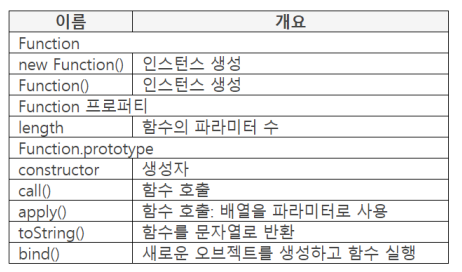

## 프로퍼티 리스트



## Function 인스턴스 생성

### new Function()

- 파라미터 : 파라미터opt, 실행 가능한 JS 코드opt

    반환 : 생성한 Function 인스턴스

- Function 인스턴스 생성
- 파라미터에 문자열로 함수의 파라미터와 함수 코드 작성

    ```java
    var obj = new Function("book", "return book;");
    obj("JS 책");
    ```

- 파라미터 수에 따라 인스턴스 생성 기준이 다름
    - 파라미터 2개 이상 작성
        - 마지막 파라미터에 함수에서 실행할 함수 코드 작성
        - 마지막을 제외한 파라미터에 이름 작성

            ```java
            var obj = new Function("one", "two", "return one + two;");
            console.log(obj(100, 200));  // 300
            ```

    - 파라미터 하나 작성
        - 함수에서 실행할 함수 코드 작성
        - 파라미터가 없을 때 사용

            ```java
            var obj = new Function("return 1 + 2;");
            console.log(obj());  // 3
            ```

    - 파라미터를 작성하지 않으면
        - 함수 코드가 없는 Function 인스턴스 생성

### Function()

- 파라미터 : 파라미터opt, 실행 가능한 JS 코드opt

    반환 : 생성한 Function 인스턴스

- Function 인스턴스 생성
- 처리 방법과 파라미터 작성이 new Function() 과 같음
- 단지 new 연산자를 사용하지 않은 것

## 함수 생명 주기, 함수 분류, length 프로퍼티

### 함수 분류

- function 분류
    - 빌트인 Function 오브젝트
    - function 오브젝트

        빌트인 Function 오브젝트로 만든다.

    - function 인스턴스(new 연산자 사용)

        문자열로 작성된 것을 함수코드로 만들면서 인스턴스를 만드는데 이 인스턴스는 function 오브젝트를 new 연산자를 사용해서 인스턴스를 만든것을 뜻한다.

- function 오브젝트 생성 방법
    - function 키워드 사용
    - function getBook (title) { return title };
- JS 엔진이 function 키워드를 만나면 이름이 getBook인 function 오브젝트 생성

    이때 이 function 오브젝트는 function 분류의 2번째 function 오브젝트에 해당된다.

### 함수 생명 주기

- 함수 호출

    ```java
    function getBook(title) {
    	return title;
    }

    var result = getBook("JS북");
    console.log(result);  // JS북
    ```

    - getBook("JS북");
    - 함수를 호출하면서 파라미터 값을 넘겨 줌
- 함수 코드 실행
    - JS 엔진 컨트롤(JS 엔진이 현재 처리하고 있는 위치)이 함수의 처음으로 이동
    - 파라미터 이름에 넘겨 받은 파라미터 값 매핑
    - 함수 코드 실행
    - return 작성에 관계없이 반환 값을 갖고 함수를 호출한 곳으로 돌아 감

### length 프로퍼티

- 함수의 파라미터 수가 생성되는 function 오브젝트에 설정 됨

    ```java
    function add(one, two) {
    	return one + two;
    }

    console.log(add.length);  // 2
    ```

- 함수를 호출한곳에서 보낸 파라미터 수가 아님

    ```java
    function add(one, two) {
    	return one + two;
    }
    add(1, 2, 3, 4);
    console.log(add.length);  // 2
    ```

## 함수 형태, 함수 선언문, 함수 표현식

- 함수 선언문(Function Declaration)

    function getBook(book) {코드}

- 함수 표현식(Function Expression)

    var getBook = function (book) {코드}

### 함수 선언문

- function : function 키워드

    식별자 : 함수 이름

    파라미터 : 파라미터 리스트opt

    함수 블록 : (실행 가능한 코드opt)

    반환 : 생성한 function 오브젝트

- function getBook(title) {함수 코드} 형태
    - function 키워드, 함수 이름, 블록{}은 작성 필수
    - 파라미터, 함수 코드는 선택

        ```java
        function getBook(title) { 
        	return title;
        }

        var result = getBook("JS책");
        console.log(result);  // JS책
        ```

- 함수 이름을 생성한 function 오브젝트의 이름으로 사용

### 함수 표현식

- function : function 키워드

    식별자 : 함수 이름opt

    파라미터 : 파라미터 리스트opt

    함수 블록 : (실행 가능한 코드opt)

    반환 : 생성한 function 오브젝트

- var getBook = function(title) {코드}
    - function 오브젝트를 생성하여 변수에 할당
    - 변수 이름이 function 오브젝트 이름이 됨

        ```java
        var getBook = function(title) {
        	return title;
        };
        var result = getBook("JS책");
        console.log(result);  // JS책
        ```

- 식별자 위치의 함수 이름은 생략 가능
    - var name = function abc() { } 에서 abc가 식별자 위치의 함수 이름

        ```java
        var getBook = function inside(value) {
        	if (value === 102) {
        		return value;
        	}
        	console.log(value);
        	return inside(value + 1);
        };
        getBook(100);

        // 100
        // 101
        ```

        - inside 이름으로 function 오브젝트를 생성하여 getBook 변수에 할당
        - 함수 외부에서 inside()를 호출할 수 없으며 getBook()을 호출하여 함수 안으로 이동한 후 inside()를 호출할 수 있다.
        - 함수안에서 inside()를 호출하는 것은 자신을 호출하는 것이므로 무한으로 반복하여 호출하게 된다.

## 함수 호출

### call()

- object : 호출할 함수 이름

    파라미터 : this로 참조할 오브젝트, 호출된 함수로 넘겨줄 파라미터opt

    반환 : 호출된 함수에서 반환한 값

- getTotal.call(this. 10, 20);

    ```java
    function getTotal(one, two) {
    	return one + two;
    }
    var result = getTotal.call(this, 10, 20);
    console.log(result);  // 30
    ```

    - 1번째 파라미터 this가 파라미터 값으로 넘어가지 않고 2번째 파라미터가 첫번째 파라미터로 넘어가고 3번째 파라미터가 두 번째 파라미터로 넘어가서 결과는 30이 된다.
    - call()은 파라미터 수가 고정일 때 사용한다.
- 첫번째 파라미터
    - 호출된 함수에서 this로 참조할 오브젝트
    - 일반적으로 this 사용. 다른 오브젝트 작성 가능

        ```java
        var value = {one: 10, two: 20};
        function getTotal() {
        	return this.one + this.two;
        }
        var result = getTotal.call(value);
        console.log(result);  // 30
        ```

        - getTotal 함수의 this는 call() 로 넘겨준 파라미터인 value 인스턴스를 참조하게 된다.

### apply()

- object : 호출할 함수 이름

    파라미터 : this로 참조할 오브젝트, [호출된 함수로 넘겨줄 파라미터opt]

    반환 : 호출된 함수에서 반환한 값

- getTotal.apply(this, [10, 20]);
- 파라미터 수가 유동적일 때 사용

    두번째 파라미터에 배열 사용

    ```java
    function getTotal(one, two) {
    	return one + two;
    }
    var result = getTotal.apply(this, [10, 20]);
    console.log(result);  // 30
    ```

    - one에 10이, two에 20이 설정된다.
- call(), apply() 부가적인 목적?
    - 첫 번째 파라미터에 호출된 함수에서 this로 참조할 오브젝트 사용

### toString()

- object : function

    파라미터 : 사용하지 않음

    반환 : 변환한 값

- 모든 빝트인 오브젝트에 toString()이 있지만 오브젝트마다 반환되는 형태가 다름
- function 오브젝트의 toString()은 함수 코드를 문자열로 반환

    ```java
    var getBook = function() {
    	return 100 + 23;
    };
    var result = getBook.toString();
    console.log(result);  // function() {result 100 + 23;}
    ```

## Argument 오브젝트

- 함수가 호출되어 함수 안으로 이동했을 때 arguments 이름으로 생성되는 오브젝트
- 함수를 호출한 곳에서 넘겨준 값을 순서대로 저장
- 호출된 함수에 파라미터를 작성한 경우
    - 호출된 함수의 파라미터에도 값을 설정하고 야규먼트 오브젝트에도 저장

        ```java
        fucntion getTotal(one) {
        	return one + arguments[1] + arguments[2];
        }
        var result = getTotal(10, 20, 30);
        console.log(result);  // 60
        ```

        - 함수가 호출받게 되면 함수안에 arguments 이름을 가진 오브젝트를 생성하고 10, 20, 30이 arguments에 순서대로 설정된다.
    - apply()와 아규먼트 오브젝트

        ```java
        function getTotal(one) {
        	return one + arguments[1] + arguments[2];
        }
        var result = getTotal.apply(this, [10, 20, 30]);
        console.log(result);  // 60
        ```

- 파라미터라고 부른 것은 아규먼트 오브젝트와 구분하기 위한 것
- 함수가 실행된 후에 함수를 빠져나오면 arguments 오브젝트도 자동으로 삭제되기 때문에 함수 밖에서 arguments 오브젝트를 접근할 수 없다.