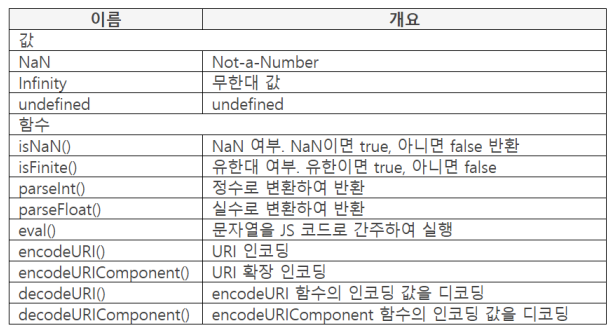

## Global 오브젝트 개요

- 모든 <script>를 통해 하나만 존재
    - new 연산자로 인스턴스 생성 불가
    - 모든 코드에서 공유
- 이름(Global)은 있지만 오브젝트 실체가 없음

    오브젝트를 작성(사용)할 수 없음

    오브젝트가 없을때 자바스크립트가 글로벌 오브젝트로 간주해서 글로벌 오브젝트에 있는 프로퍼티 값을 구한다.

## Global 오브젝트 함수, 변수

- Global 오브젝트의 함수, 변수를 Global 함수, Global 변수라고 부름
- 함수안에 작성한 것
    - 지역함수, 로컬함수라고 부름
    - 지역변수, 로컬변수라고 부름
- 전역 객체라고 부르기도 하지만 Global은 오브젝트 이름

    강좌에서는 글로벌 오브젝트로 표기

## Global 프로퍼티

## 프로퍼티 리스트



- 글로벌 오브젝트는 인스턴스를 만들지 못하므로 값과 함수만 있다.
- eval() 은 보안관련문제때문에 되도록이면 사용하지 않는 것이 좋다.

### Global 프로퍼티

- Global 프로퍼티 종류
    - NaN: Not-a-Number
    - Infinity: 무한대
    - undefined: undefined
- 상수 개념으로 사용. 외부에서 프로퍼티 값 변경 불가

    ```java
    console.log(NaN);  // NaN
    console.log(Infinity);  // Infinity
    console.log(undefined);  // undefined
    ```

    - Number.MAX_VALUE 처럼 프로퍼티 앞에 오브젝트 이름을 작성해야 하지만 글로벌 오브젝트는 실체가 없으므로 이름을 작성하지 않고 프로퍼티 이름만 작성
    - 오브젝트 이름을 작성하지 않으면 글로벌 프로퍼티로 인식
- delete 연산자로 삭제 불가

## Global과 Window 관계

- 글로벌과 window 오브젝트의 주체
    - 글로벌 오브젝트는 JS가 주체
    - window 오브젝트는 window가 주체
- 주체는 다르지만, 글로벌 오브젝트의 프로퍼티와 함수가 window 오브젝트에 설정됨

    ```java
    console.log(undefined);  // undefined
    console.log(window.undefined);  // undefined
    ```

- Host 오브젝트 개념 활용

    브라우저 안에 있는 오브젝트를 자바스크립트에서 마치 내것처럼 쓰는 개념

## 정수, 실수 변환

### parseInt()

- 파라미터 : 값, 진수(디폴트 : 10진수)

    반환 : 변환한 값

- 값을 정수로 변환하여 반환
    - 값이 123.56이면 123 반환

        ```java
        console.log(parseInt(123.56));  // 123
        ```

- 값이 "123px" 이면 123 반환
    - 이 용도로도 많이 사용

        ```java
        console.log(parseInt("-123.45"));  // -123
        console.log(parseInt("123px"));  // 123
        console.log(parseInt("12AB34"));  // 12
        ```

- 0 또는 빈 문자열을 제외시킴

    ```java
    console.log(parseInt("0012"));  // 12
    console.log(parseInt("   123"));  // 123
    console.log(parseInt());  // NaN
    ```

    - 값을 작성하지 않으면 NaN. undefined가 아닌 것은 기준이 Number 이기 때문
- 진수를 적용하여 값을 변환

    ```java
    console.log(parseInt(13, 16));  // 19
    console.log(parseInt("0x13"));  // 19
    ```

### parseFloat()

- 파라미터 : 값

    반환 : 변환한 값

- 값을 실수로 변환하여 반환
    - JS는 기본적으로 실수로 처리하므로 실수로 변환하는것이 의미가 없지만 문자열의 실수 변환은 의미가 있음

        ```java
        console.log(parseFloat("-123.45") + 6);  // -117.45
        console.log(parseFloat("12.34AB56"));  // 12.34
        ```

        - 문자 이후는 변환하지 않으므로 12.34 까지만 변환한다.
- 지수, 공백 변환

    ```java
    console.log(parseFloat("1.2e3"));  // 1200
    console.log(parseFloat("  12.34  ") + 20);  // 32.34
    console.log(parseFloat());  // NaN
    ```

## NaN, 유한대 체크 함수

### isNaN()

- 파라미터 : 값

    반환 : true, false

- 값의 NaN 여부 반환
- 숫자값이 아니면 true 반환

    ```java
    console.log(isNaN("ABC"));  // true
    console.log(isNaN());  // true
    ```

- 숫자 값이면 false 반환
    - 값이 숫자로 변환되면 숫자로 인식

        ```java
        console.log(isNaN(123));  // false
        console.log(isNaN("123"));  // false
        console.log(isNaN(null));  // false
        ```

        - String 타이비이라도 값이 숫자이면 숫자로 인식
        - null을 숫자로 변환하면 0
- NaN === NaN 결과는 false
    - 설계 실수
    - ES6의 Object.js() 사용

        ```java
        console.log(NaN === NaN);  // false
        console.log(Object.is(NaN, NaN));  // true
        ```

### isFinite()

- 파라미터 : 값

    반환 : true, false

- 값이 Infinity, NaN이면 false 반환

    아니면 즉, 유한이면 true 반환

    ```java
    // NaN
    console.log(isFinite(0 / 0));  // false
    // Infinity
    console.log(isFinite(1 / 0));  // false
    console.log(isFinite("ABC"));  // false
    ```

- 값이 숫자로 변환되면 숫자로 인식

    ```java
    console.log(isfinite(123));  // true
    console.log(isFinite("123"));  // true
    console.log(isFinite(false));  // true
    ```

## 인코딩, 디코딩

### encodeURI()

- 파라미터 : URI

    반환 : 인코딩 결과

- URI(Uniform Resource Identifier)를 인코딩하여 반환
    - 인코딩 제외 문자를 제외하고 "%16진수%16진수" 형태로 변환

        ```java
        var uri = "data?a=번&b=호";
        console.log(encodeURI(uri));  // data?a=%EB%B2%88&b=%ED%98%B8
        ```

        - 비동기통신인 ajax가 나온 이후로 잘 사용하지 않는다. ajax는 인코딩 하지 않고 json으로 파싱해서 보내준다.
- 인코딩 제외 문자
    - 영문자, 숫자
    - #  ;  /  ?  :  @  &  =  +  $  ,  -  _  .  !  ~  *  (  )  따옴표

### encodeURIComponent()

- 파라미터 : URI

    반환 : 인코딩 결과

- URI를 인코딩하여 반환
    - ";  /  ?  :  @  &  =  +  $  ,"를 인코딩하는 것이 endcodeURI()와 다름
    - 인코딩 제외 문자를 제외하고 "%16진수 16진수" 형태로 변환
- 인코딩 제외 문자
    - 영문자, 숫자
    - #  -  _  .  !  ~  *  (  )  따옴표

### decodeURI()

- 파라미터 : 인코딩 문자열

    반환 : 디코딩 결과

- 인코딩을 디코딩하여 반환
- 파라미터에 encodeURI()로 인코딩한 문자열 작성

    ```java
    var uri = "data?a=%EB%B2%88&b=%ED%98%B8";
    console.log(decodeURI(uri));  // data?a=번&b=호
    ```

### decodeURIComponent()

- 파라미터 : 인코딩 문자열

    반환 : 디코딩 결과

- 인코딩을 디코딩하여 반환
- 파라미터에 encodeURIComponent()로 인코딩한 문자열 작성

## eval() 함수

- 파라미터 : JS 코드

    반환 : JS 코드를 실행하여 반환한 것

- 파라미터의 문자열을 JS 코드로 간주하여 실행
    - 실행 결과를 반환 값으로 사용. 값을 반환하지 않으면 undefined 반환

    ```java
    var result = eval("parseInt('-123.45')");
    console.log(result);  // -123
    ```

- 보안에 문제가 있다고 알려져 있음. 사용 비권장