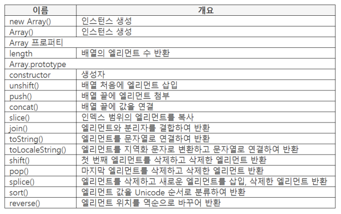

## Array 오브젝트 개요

- 빌트인 오브젝트
- Array(배열) 형태
    - [123, "ABC", "가나다"]
    - 대괄호 안에 콤마로 구분하여 값 작성
- 배열 엘리먼트
    - [123, "ABC"]에서 123, "ABC" 각각을 엘리먼트 또는 요소라고 부름
    - 2의 32승(4,294,967,296) - 1개

### 배열 생성 방법

- new Array()로 생성

    ```java
    var book = new Array();
    ```

- Array() 로 생성

    ```java
    var book = Array();
    ```

- 대괄호로 생성

    ```java
    var book = [];
    ```

    - 일반적으로 이 형태를 사용

### 엘리먼트 작성 방법

```java
var book = ["책1", '책2'];
```

- String 타입은 큰따옴표, 작은따옴표 모두 가능
- JS의 모든 타입의 값, 오브젝트 사용 가능
- 값을 작성하지 않고 콤마만 작성하면 undefined 가 설정됨

## 프로퍼티 리스트



- sort() 는 순서대로 인데 역순을 구하고 싶을땐 sort() 콜백에 역순구하는 알고리즘을 직접 구현해야 함

## Array 인스턴스 생성

### new Array()

- Array 인스턴스 생성, 반환
- 배열 생성 기준
    - 파라미터에 따라 배열 생성 기준이 다름
    - 파라미터를 작성하지 않으면 빈 배열

        ```java
        var obj = new Array();
        console.log(typeof obj);  // object
        console.log(obj.length);  // 0
        ```

        - new Array()로 생성한 인스턴스 타입은 object. 인스턴스는 타입이 object 이다.
    - 작성한 순서로 엘리먼트에 설정

        ```java
        var one = new Array(10, 20);
        console.log(one);  // [10, 20]

        var two = new Array([30, 40]);
        console.log(two);  // [[30, 40]]
        ```

    - new Array(3) 처럼 파라미터에 숫자를 작성하면 3개의 엘리먼트 생성

        ```java
        var obj = new Array(3);
        console.log(obj);  // [undefined, undefined, undefined]
        ```

### Array()

- Array 인스턴스 생성, 반환
    - new Array()와 생성 방법 및 기능 같음
- 인스턴스 생성 논리
    - new Array()는 new 연산자에서 생성자 함수를 호출하여 인스턴스 생성
    - Array()는 직접 생성자 함수를 호출하여 인스턴스 생성
    (일반적으로 앞이 대문자이면 함수나 메소드가 아닌 생성자함수이다.)

### length 프로퍼티

- 배열 [1, 2, 3]에서 length 값은 3
- Array 오브젝트에 {length: 3} 형태로 설정

    ```java
    var value = [1, 2, 3];
    console.log(value.length);  // 3
    ```

- 열거/삭제는 할 수 없지만, 변경은 가능
- length 값을 변경하면 배열의 엘리먼트 수가 변경됨

    ```java
    var value = [1, 2, 3];
    value.length = 5;
    console.log(value);  // [1, 2, 3, undefined, undefined]
    ```

    ```java
    var value = [1, 2, 3];
    value.length = 2;
    console.log(value);  // [1, 2]
    ```

    - 줄이면 뒤의 엘리먼트가 삭제된다.

## 엘리먼트 추가, 삭제 메커니즘, delete 연산자

### 엘리먼트 추가

- 배열에 엘리먼트를 추가하는 방법
    - 삽입할 위치에 인덱스 지정

        ```java
        var value = [1, 2];
        value[4] = 5;
        console.log(value);  // [1, 2, undefined, undefined, 5]
        ```

        - 값을 설정하지 않은 추가된 엘리먼트에 undefined 설정
    - 표현식으로 인덱스 지정

        ```java
        var value = [1, 2];
        value[value.length + 2] = 5;
        console.log(value);  // [1, 2, undefined, undefined, 5]
        ```

### delete 연산자 (배열내의 연산자가 아닌 다른곳에서도 사용가능한 delete 연산자)

- object : 매치 대상

    프로퍼티 : 삭제할 프로퍼티 이름

    인덱스 : 배열의 인덱스

    반환 : 삭제 성공 true, 실패 false

- var 변수는 삭제 불가

    ```java
    var value = 123;
    console.log(delete value);  // false
    ```

- 글로벌 변수는 삭제 가능

    ```java
    value = "글로벌 변수";
    console.log(delete value);

    try {
    	console.log(value);
    } catch(e) {
    	console.log("존재하지 않음");
    }

    // true
    // 존재하지 않음
    ```

- {name: value} 삭제 방밥
    - 삭제할 프로퍼티 이름 작성

        ```java
        var book = {title: "책"};
        console.log(delete book.title);  // true
        console.log(book.title);  // undefined
        ```

        ```java
        var book = {title: "책"};
        console.log(delete book);  // false

        sports = {item: "축구"};
        console.log(delete sports);  // true
        ```

        - var 변수에 오브젝트를 할당하면 오브젝트 전체를 삭제할 수 없다.
    - ES5에서 삭제 불가 설정 가능
- 인덱스로 배열의 엘리먼트 삭제

    ```java
    var value = [1, 2, 3, 4];
    console.log(delete value[1]);  // true
    console.log(value.length);  // 4
    ```

    - 삭제를 했음에도 불구하고 length는 변하지 않는다.

### 배열 엘리먼트 삭제 메커니즘

- 삭제된 인덱스에 undefined 설정

    ```java
    var value = [1, 2, 3, 4];
    delete value[1];
    console.log(value);  // ]1, undefined, 3, 4]

    for (var k = 0; k < value.length; k++) {
    	console.log(value[k]);
    }

    // 1
    // undefined
    // 3
    // 4
    ```

    - 배열을 읽을 때 제외시켜야 한다.

## 엘리먼트 삽입, 첨부

### unshift()

- data : 기준

    파라미터 : [item1 [, item2 [, ...]]] opt

    반환 : 추가 후의 length

- 0번 인덱스에 파라미터 값 삽입
- 배열에 있던 엘리먼트는 뒤로 이동

    ```java
    var value = [1, 2];
    value.unshift(345, 67);
    console.log(value);  // [345, 67, 1, 2]
    ```

### push()

- data : 첨부 기준

    파라미터 : [item1 [, item2 [, ...]]]opt

    반환 : 첨부 후의 length

- 배열 끝에 파라미터 값을 첨부

    ```java
    var value = [1, 2];
    value.push(345, 67);
    console.log(value);  // [1, 2, 345, 67]
    ```

### concat()

- data : 연결 기준

    파라미터 : [item1 [, item2 [, ...]]] opt

    반환 : 연결 결과

- 배열에 파라미터 값을 연결하여 반환

    ```java
    var value = [1, 2];
    var result = value.concat(3, 4);
    console.log(result);  // [1, 2, 3, 4]
    ```

- 파라미터가 1차원 배열이면 값만 반영

    ```java
    var value = [1, 2];
    var result = value.concat([3], [4]);
    console.log(result);  // [1, 2, 3, 4]
    ```

## 엘리먼트 복사

### slice()

- data : 대상

    파라미터 : 시작 인덱스(디폴트 : 0), 끝 인덱스opt(디폴트 : length)

    반환 : [결과]

- 배열의 일부를 복사하여 배열로 반환
    - 첫번재 파라미터의 인덱스부터 두번째 인덱스 직전까지

        ```java
        var origin = [1, 2, 3, 4, 5];
        var result = origin.slice(1,3);
        console.log(result);  // [2, 3]
        console.log(origin);  // [1, 2, 3, 4, 5]
        ```

        - 복사 대상 원본은 바뀌지 않는다.
- true, false 를 숫자로 변환

    ```java
    var value = [1, 2, 3, 4, 5];
    console.log(value.slice(true, 3));  // [2, 3]
    console.log(value.slice(false, 3));  // [1, 2, 3]
    ```

- 첫 번째 파라미터만 작성

    ```java
    console.log([1, 2, 3, 4, 5].slice(2));  // [3, 4, 5]
    ```

- 첫 번째 파라미터 값이 클 때

    ```java
    console.log([1, 2, 3, 4, 5].slice(4, 3));  // []
    ```

    - 빈 배열 반환
- 파라미터에 음수 작성

    ```java
    var value = [1, 2, 3, 4, 5];
    console.log(value.slice(-4, -2));  // [2, 3]
    ```

    - 파라미터 값이 음수이면 length 값을 더한다.

## 엘리먼트 값을 문자열로 변환

### join()

- data : 기준

    파라미터 : 분리자opt(디폴트 : 콤마(,))

    반환 : 연결한 문자열

- 엘리먼트와 분리자를 하나씩 결합하여 문자열로 연결
    - [0] 인덱스, 분리자, [1] 인덱스, 분리자
- 마지막 엘리먼트는 분리자를 연결하지 않음

    ```java
    var value = [1, 2, 3];
    var result = value.join("##");

    console.log(result); // 1##2##3
    console.log(typeof result);  // string
    ```

- 파라미터를 작성하지 않으면 콤마로 분리

    ```java
    var value = [1, 2, 3];
    var result = value.join();
    console.log(result);  // 1,2,3
    ```

- 파라미터에 빈 문자열 작성

    ```java
    var value = [1, 2, 3];
    var result = value.join("");
    console.log(result);  // 123
    ```

### toString()

- data : 변환 대상

    파라미터 : 사용하지 않음

    반환 : 변환한 값

- 배열의 엘리먼트 값을 문자열로 연결
    - 콤마로 엘리먼트를 구분

        ```java
        var result = ["A", "B", "C"].toString();
        console.log(result);  // A,B,C
        console.log([["가"], ["다"]].toString());  // 가,다
        ```

        - 2차원 배열의 각 엘리먼트 값을 1차원 배열로 펼치고 다시 1차원을 문자열로 연결하여 반환

### toLocaleString()

- data : 변환 대상

    파라미터 : 사용하지 않음

    반환 : 변환한 값

- 엘리먼트 값을 지역화 문자로 변환
    - 문자열을 콤마로 연결하여 반환

        ```java
        var value = [12, 34, 56];
        console.log(value.toLocaleString("zh-Hans-CN-u-nu-hanidec"));  // 一二,三四,五六
        ```

## 엘리먼트 삭제

### shift()

- data : 대상

    파라미터 : 사용하지 않음

    반환 : 삭제한 엘리먼트

- 배열의 첫 번째 엘리먼트 삭제
- 삭제한 엘리먼트 값이 undefined로 남지 않고 완전히 삭제됨
    - legnth 값이 하나 줄어 듬

        ```java
        var value = [1, 2, 34];
        console.log(value.shift());  // 1
        console.log(value);  // [2, 34]
        ```

        - 삭제한 엘리먼트 반환
- 빈 배열이면 undefined가 반환됨

    ```java
    var result = [].shift();
    console.log(result);  // undefined
    ```

### pop()

- data : 대상

    파라미터 : 사용하지 않음

    반환 : 삭제한 엘리먼트

- 배열의 마지막 엘리먼트 삭제
- 삭제한 엘리먼트 값이 undefined로 남지 않고 완전히 삭제됨
    - length 값이 하나 줄어 듬

        ```java
        var value = [1, 2, 34];
        console.log(value.pop());  // 34
        console.log(value);  // [1, 2]
        ```

- 빈 배열이면 undefined 반환

    ```java
    var result = [].pop();
    console.log(result);  // undefined
    ```

### splice()

- data : 대상

    파라미터 : 시작 인덱스(디폴트 : 0), 삭제할 엘리먼트 수, 추가할 엘리먼트([item1 [, ...]]]opt

    반환 : [결과]

- 엘리먼트를 삭제하고 삭제한 엘리먼트 반환

    ```java
    var value = [1, 2, 3, 4, 5];
    console.log(value.splice(1, 3));  // [2, 3, 4]
    console.log(value);  // [1, 5]
    ```

- 삭제한 위치에 세 번째 파라미터 삽입

    ```java
    var value = [1, 2, 3, 4, 5];
    console.log(value.splice(1, 3, "A", "B"));  // [2, 3, 4]
    console.log(value);  // [1, A, B, 5]
    ```

- 파라미터를 작성하지 않으면?

    ```java
    var value = [1, 2, 3, 4, 5];
    console.log(value.splice());  // []
    console.log(value);  // [1, 2, 3, 4, 5]
    ```

    - 삭제하지 않는다. 첫번째 파라미터는 시작인덱스로 디폴트가 0이고 두번째 파라미터인 삭제할 엘리먼트 수가 없기 때문에 삭제를 아무것도 하지 않는다.

## sort(분류)

### sort()

- data : 대상

    파라미터 : 함수opt

    반환 : sort 결과

- 엘리먼트 값을 승순으로 정렬
- 정렬 기준은 엘리먼트 값의 Unicode
    - 코드 포인트가 작으면 앞에 오고 크면 뒤에 온다.

        ```java
        var value = [4, 2, 3, 1];
        console.log(value.sort());  // [1, 2, 3, 4]
        ```

        ```java
        var value = ["A1", "A01", "B2", "B02"];
        console.log(value.sort());  // [A01, A1, B02, B2]
        ```

        - 왼쪽에서 오른쪽으로 문자 하나씩 비교하여 정렬
- 주의 : sort 대상 배열도 정렬됨

    ```java
    var value = [4, 2, 3, 1];
    console.log(value.sort());  // [1, 2, 3, 4]
    console.log(value);  // [1, 2, 3, 4]
    ```

- 값이 undefined이면 끝으로 이동

    ```java
    var value = [, , 1, 2];
    console.log(value.sort());  // [1, 2, undefined, undefined]
    ```

### sort()와 Unicode

- 숫자에 해당하는 Unicode의 code point로 정렬

    ```java
    var value = [101, 26, 7, 1234];
    console.log(value.sort());  // [101, 1234, 26, 7]
    ```

    - 사람이 생각하는 일반적인 정렬은 [7, 26, 101, 1234] 이지만 코드포인트로 비교하기 때문에 그렇지 않다.
    - 우선 첫째짜리 1, 2, 7, 1 을 비교하고, 그 다음 0과 2를 비교하므로 [101, 1234, 26, 7] 가 된다.
    - 이를 해결하려면 sort() 파라미터에 함수를 작성하고 함수에서 정렬해야 한다.

## sort 알고리즘

### sort()

- sort 알고리즘

    ```java
    var value = [101, 26, 7, 1234];
    value.sort(function(one, two){
    	return one - two;
    });
    console.log(value);  // [7, 26, 101, 1234]
    ```

    1. 101 과 26을 one, two에 설정한다.
    2. 결과는 양수이며 0보다 큰 값이 반환되면 배열에서 값의 위치는 바꾼다. 즉, [26, 101, 7, 1234]가 된다.
    3. 다시 콜백 함수를 호출하면서 101과 7을 넘겨준다.
    4. 결과는 양수이며 0보다 큰 값을 반환하므로 배열에서 값의 위치를 바꾼다. 즉 [26, 7, 101, 1234]가 된다.
    5. 다시 함수를 호출하면서 101과 1234를 넘겨주면 결과는 음수이다. 0보다 작은 값이므로 값의 위치를 바꾸지 않는다. 따라서 [26, 7, 101, 1234]가 된다.
    6. 다시 처음으로 돌아가 바뀌는 것이 없을 때 까지 배열의 엘리먼트 위치를 조정한다.
    - 사람이 생각하는 승순으로 정렬되었다.

### reverse()

- data : 대상

    파라미터 : 사용하지 않음

    반환 : 결과

- 배열의 엘리먼트 위치를 역순으로 바꿈
    - 엘리먼트 값이 아닌 인덱스 기준

        ```java
        var value = [1, 3, 7, 5];
        console.log(value.reverse());  // [5, 7, 3, 1]
        ```

    - 대상 배열도 바뀜