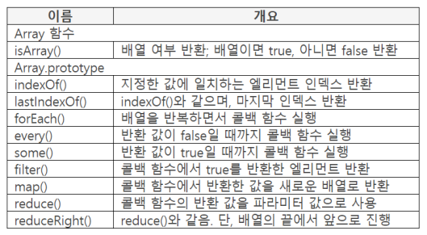

## 프로퍼티 리스트 (ES5)



### isArray()

- object : Array 오브젝트

    파라미터 : 체크대상

    반환 : 배열 true, 아니면 false

- 체크 대상이 배열이면 true, 아니면 false
- isArray()는 함수

    ```java
    console.log(Array.isArray([1, 2]));  // true
    console.log(Array.isArray(123));  // false
    ```

- isArray() 함수가 필요한 이유

    ```java
    console.log(typeof {a: 1});  // object
    console.log(typeof [1, 2]);  // object
    console.log(typeof null);  // object
    ```

    - 배열임에도 불구하고 object 라고 나와서 배열인지 아닌지 체크할 수 없다. 이럴 때 사용한다.
    - null 인지 여부는 Object.is() 사용 (ES6)

## index 처리 메소드

### indexOf()

- data : 검색 대상

    파라미터 : 검색할 값, 검색시작 인덱스(디폴트 : 0)

    반환 : 검색된 인덱스

- 파라미터 값과 같은 엘리먼트의 인덱스 반환
    - 왼쪽에서 오른쪽으로 검색
    - 값이 같은 엘리먼트가 있으면 검색 종료

        ```java
        var value = [1, 2, 5, 2, 5];
        console.log(value.indexOf(5));  // 2
        ```

    - 데이터 타입까지 체크

        ```java
        var value = [1, 2, 5, 2, 5];
        console.log(value.indexOf("5"));  // -1
        ```

- 두 번째 파라미터의 인덱스부터 검색

    ```java
    var value = [1, 2, 5, 2, 5];
    console.log(value.indexOf(5, 3));  // 4
    ```

- String과 Array의 indexOf() 차이

    ```java
    console.log("ABCBC".indexOf("C", -2));  // 2
    var list = ["A", "B", "C", "B", "C"];
    console.log(list.indexOf("C", -2));  // 4
    ```

    - 두번째 파라미터에 음수를 작성했을 때 검색방법이 다르다.
    - String은 0으로 간주하여 처음부터 검색하고 Array 오브젝트는 음수에 length를 더해 시작인덱스로 사용한다.

### lastIndexOf()

- data : 검색 대상

    파라미터 : 검색할 값, 검색시작 인덱스 opt

    반환 : 검색된 인덱스

- 파라미터 값과 같은 엘리먼트의 마지막 인덱스 반환

    다른 처리 방법은 indexOf()와 같음

    ```java
    var value = [1, 2, 5, 2, 5];
    console.log(value.lastIndexOf(5));  // 4
    ```

## 콜백 함수를 가진 Array 메소드

**지금부터 다루는 7개 메소드는 모두 콜백함수를 호출. 키워드는 시맨틱과 독립성**

### forEach()

- data : 반복 대상

    파라미터 : 콜백 함수, this로 참조할 오브젝트opt

    반환 : undefined

- 배열의 엘리먼트를 하나씩 읽어가면서 콜백 함수 호출
- 콜백 함수 파라미터
    - 엘리먼트 값, 인덱스, 배열 전체

        ```java
        var list = ["A", "B", "C"];
        list.forEach(function(el, index, all){
        	console.log(el + ":" + index + ":" + all);
        });

        // A:0:A,B,C
        // B:1:A,B,C
        // C:2:A,B,C
        ```

- break, continue 사용 불가. throw는 사용 가능
- 콜백 함수 분리(독립성)

    ```java
    var list = ["A", "B", "C"];
    var fn = function(el, index, all) {
    	console.log(el + ":" + index + ":" + all);
    };

    list.forEach(fn);

    // A:0:A,B,C
    // B:1:A,B,C
    // C:2:A,B,C
    ```

    - 콜백함수가 중복된다면 분리해서 별도로 작성하는것이 좋다.
- this로 오브젝트 참조

    ```java
    var list = [1, 2];
    var fn = function(el, index, all) {
    	console.log(el + this.ten);
    };

    list.forEach(fn, {ten: 10});

    // 11
    // 12
    ```

    - 함수 안에서 값(데이터)을 사용하는 방법 - 파라미터, 변수, this로 참조, 함수호출(반환값)

## for()와 forEach() 차이

### forEach()

- forEach()를 시작할 때 반복 범위 결정
- 엘리먼트를 추가하더라도 처리하지 않음

    ```java
    var list = [1, 2, 3];
    var fn = function(el, index, all) {
    	if (index === 0) {
    		list.push("AB");
    	}
    	console.log(el);
    };
    list.forEach(fn);

    // 1
    // 2
    // 3
    ```

- 현재 인덱스보다 큰 인덱스의 값을 변경하면 변경된 값을 사용

    ```java
    var list = [1, 2, 3];
    var fn = function(el, index, all) {
    	if (index === 0) {
    		list[2] = 345;
    	}
    	console.log(el);
    };
    list.forEach(fn);

    // 1
    // 2
    // 345
    ```

    - 현재 인덱스보다 작은 인덱스의 값을 변경하면 처리하지 않음(당연!)
- 현재 인덱스보다 큰 인덱스의 엘리먼트를 삭제하면 배열에서 삭제되므로 반복에서 제외됨

    ```java
    var list = [1, 2, 3];
    var fn = function(el, index, all) {
    	if (index === 0) {
    		delete list[2];
    	}
    	console.log(el);
    };
    list.forEach(fn);

    // 1
    // 2
    ```

    - 추가는 처리하지 않지만, 삭제는 반영

### for()와 forEach()

- forEach()는 시맨틱 접근
    - 처음부터 끝까지 반복한다는 시맨틱
    - 반복 중간에 끝나지 않는다는 시맨틱
    - 시맨틱으로 소스 코드의 가독성 향상
- for()는 함수 코드를 읽어야 알 수 있음
    - break, continue
- forEach()는 반복만 하며 콜백 함수에서 기능 철, this 사용 가능
- forEach()는 인덱스 0부터 시작
    - for()와 같이 인덱스 증가 값을 조정할 수 없음
    - 뒤에서 앞으로 읽을수도 없음. 이것도 시맨틱 접근

## true, false를 반환하는 메소드

### every()

- data : 반복 대상

    파라미터 : 콜백 함수, this로 참조할 오브젝트opt

    반환 : true, false

- forEach() 처럼 시맨틱 접근
- 배열의 엘리먼트를 하나씩 읽어가면서 false를 반환할 때 까지 콜백함수 호출

    즉, false가 반환되면 반복 종료

    false를 반환하지 않으면 true 반환

    ```java
    var value = [20, 10, 30, 40];
    var fn = function(el, index, all) {
    	console.log(el);
    	return el > 15;
    };
    var result = value.every(fn);
    console.log("결과:", result);

    // 20
    // 10
    // 결과:false
    ```

### some()

- data : 반복 대상

    파라미터 : 콜백 함수, this로 참조할 오브젝트 opt

    반환 : true, false

- every() 처럼 시맨틱 접근
- 단, true를 반환할 때까지 콜백 함수 호출

    즉, true가 반환되면 반복 자동 종료

    true를 반환하지 않으면 false 반환

    ```java
    var value = [10, 20, 30, 40];
    var fn = function(el, index, all) {
    	console.log(el);
    	return el > 15;
    };
    var result = value.some(fn);
    console.log("결과:", result);

    // 10
    // 20
    // 결과:true
    ```

- true가 되는 조건이 배열의 앞에 있을 때 효율성 높음

## 필터, 매핑

### filter()

- data : 반복 대상

    파라미터 : 콜백 함수, this로 참조할 오브젝트opt

    반환 : [true일 때의 엘리먼트]

- forEach() 처럼 시맨틱 접근
- 배열의 엘리먼트를 하나씩 읽어가면서 콜백 함수에서 true를 반환하면 현재 읽은 엘리먼트를 반환

    ```java
    var value = [10, 20, 30, 40];
    var fn = function(el, index, all) {
    	return el > 15;
    };
    var result = value.filter(fn);
    console.log(result);

    // [20, 30, 40]
    ```

    - 콜백함수에서 true가 하나도 없이 false만 반환하면 빈 배열이 result 변수에 할당됨
- 조건에 맞는 엘리먼트를 추려낼 때 유용

### map()

- data : 반복 대상

    파라미터 : 콜백 함수, this로 참조할 오브젝트opt

    반환 : [콜백 함수에서 반환한 엘리먼트]

- forEach()처럼 시맨틱 접근
- 배열의 엘리먼트를 하나씩 읽어가면서 콜백 함수에서 반환한 값을 새로운 배열에 첨부하여 반환

    ```java
    var value = [10, 20, 30];
    var fn = function(el, index, all) {
    	return el + this.add;
    };

    var point = {add: 100};
    var result = value.map(fn, point);
    console.log(result); // [110, 120, 130]
    ```

## 반환 값을 파라미터 값으로 사용

### reduce()

- data : 반복 대상

    파라미터 : 콜백 함수, 초깃값opt

    반환 : 콜백함수에서 반환한 값

- forEach() 처럼 시맨틱 접근
- 배열 끝까지 콜백 함수 호출
    - 파라미터 작성 여부에 따라 처리가 다름
- 콜백 함수만 작성한 경우. 즉, 파라미터를 하나만 작성

    ```java
    var value = [1, 3, 5, 7];
    var fn = function(prev, curr, index, all) {
    	console.log(prev + "," + curr);
    	return prev + curr;
    };
    var result = value.reduce(fn);
    console.log("결과:", result);

    // 1,3
    // 4,5
    // 9,7
    // 결과:16
    ```

    - 처음 콜백 함수를 호출할 때 [0]의 값을 직전값에 설정하고 [1]의 값을 현재값에 설정한 뒤 인덱스에 1을 설정한다.
    - 두번째로 콜백 함수를 호출할 때 콜백함수에서 반환된 값을 직전값에 설정하고 인덱스 [2]의 값을 현재값에 설정한다.
- 두번째 파라미터를 작성한 경우

    ```java
    var value = [1, 3, 5];
    var fun = function(prev, curr, index, all) {
    	console.log(prev + "," + curr);
    	return prev + curr;
    };
    var result = value.reduce(fn, 7);
    console.log("반환:", result);

    // 7,1
    // 8,3
    // 11,5
    // 반환:16
    ```

    - 처음 콜백함수를 호출할 때 두번째 파라미터 값을 직전값에 설정하고 인덱스 [0]의 값을 현재 값에 설정한 뒤 인덱스에 0을 설정한다.
    - 두번째로 콜백 함수를 호출할 때 콜백 함수에서 반환된 값을 직전 값에 설정한 뒤 인덱스 [1]의 값을 현재 값에 설정

### reduceRight()

- data : 반복 대상

    파라미터 : 콜백 함수, 초깃값opt

    반환 : 콜백 함수에서 반환한 값

- reduce()와 처리 방법 같음
- 배열 끝에서 앞으로 하나씩 읽어가면서 콜백 함수에서 반환한 값을 반환

    ```java
    var value = [1, 3, 5, 7];
    var fn = function(prev, curr, index, all) {
    	console.log(prev + "," + curr);
    	return prev + curr;
    };
    var result = value.reduceRight(fn);
    console.log("반환:", result);

    // 7,5
    // 12,3
    // 15,1
    // 반환:16
    ```