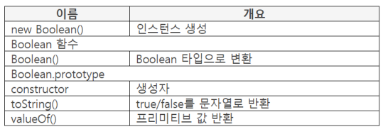

## Boolean 오브젝트

- 빌트인 오브젝트
    - true와 false 처리
- 값이 있으면 true로 인식
- false 인식 기준
    - undefined, null, NaN
    - **빈 문자열**, 숫자타입의 0
- 숫자 값 변환 기준
    - true를 1로, false 를 0으로 변환

## 프로퍼티 리스트



### new Boolean()

- 파라미터 : 값

    반환 : 생성한 Boolean 인스턴스

- Boolean 인스턴스 생성
- 파라미터 값을 true 또는 false로 변환하여 프리미티브에 설정

    ```java
    var value = [undefiend, null, NaN, 0, ""];
    for (var k = 0; k < value.length; k++) {
    	var obj = new Boolean(value[k]);
    	console.log(obj + 1);
    }

    // 1
    // 1
    // 1
    // 1
    // 1
    ```

- 문자열이면서 값이 있으면 true로 변환

    ```java
    var value = [12, "1", "0", "false"];
    for (var k = 0; k < value.length; k++) {
    	var obj = new Boolean(value[k]);
    	console.log(obj + 1);
    }

    // 2
    // 2
    // 2
    // 2
    ```

### Boolean()

- 파라미터 : 값

    반환 : 변환한 값

- Boolean 값으로 변환
- 인스턴스를 생성하지 않고 true 또는 false 로 변환

    ```java
    var value = [12, "1", "0", "false"];
    for (var k = 0; k < value.length; k++) {
    	console.log(Boolean(value[k]) + 1);
    }

    // 2
    // 2
    // 2
    // 2
    ```

### toString()

- data : 변환 대상

    파라미터 : 사용하지 않음

    반환 : 문자열로 변환한 값

- data 위치의 true, false를 문자열로 변환. 즉, "true", "false"로 변환

    ```java
    var result = true.toString();
    console.log(result);  // true
    console.log(typeof result);  // string
    ```

### valueOf()

- object : Boolean 인스턴스

    파라미터 : 사용하지 않음

    반환 : true, false

    - Boolean 인스턴스의 프리미티브 값 반환. 즉, true 또는 false 반환

        ```java
        var obj = new Boolean(3);
        console.log(obj.valueOf());  // true
        ```