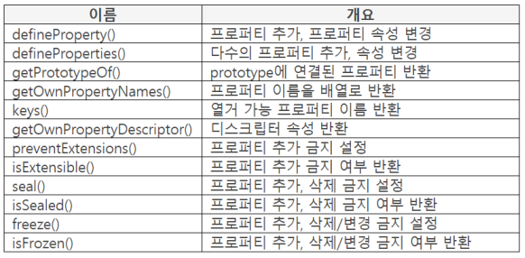
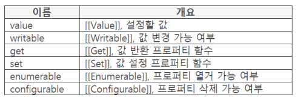
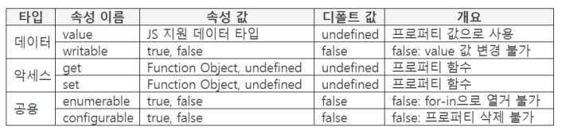

## ES5 Object 특징

- ES5 Object 에 함수가 추가됨
    - 메소드는 하나도 없음
- 빌트인 Object의 모든 메소드는 대부분의 빌트인 오브젝트에 첨부됨
    - 빌트인으로 오브젝트를 생성하므로 연결이 많이 발생
- 함수는 첨부되지 않으므로 연결 부하를 줄일 수 있음

### ES5 Object 함수



### 프로퍼티 디스크립터



## Object에 프로퍼티 추가

### defineProperty()

- object : Object 오브젝트

    파라미터 : 대상 오브젝트, 프로퍼티 이름, 속성

    반환 : 대상 오브젝트

- 대상 오브젝트에 프로퍼티 추가 또는 프로퍼티 속성 변경
- 프로퍼티마다 상태를 갖고 있음
    - 상태란? 변경/삭제/열거 가능 여부
    - 상태가 가능일 때만 처리할 수 있음
    - 프로퍼티를 추가할 때 상태 결정

        ```java
        var obj = {};
        Object.defineProperty(obj, "book", {
        	value: "JS북",
        	enumerable: true
        });
        console.log(obj);  // {book: JS북}
        ```

### defineProperties()

- object : Object 오브젝트

    파라미터 : 대상 오브젝트, 프로퍼티 이름과 속성

    반환 : 대상 오브젝트

- 다수의 프로퍼티를 추가하거나 속성 변경
    - 함수 기능은 defineProperty()와 같음

        ```java
        var obj = {};
        Object.defineProperties(obj, {
        	soccer: {
        		value: "축구", enumerable: true
        	},
        	basketball: {
        		value: "농구", enumerable: true
        	}
        });
        for (var name in obj) {
        	console.log(name + ":" + obj[name]);
        }
        // soccer:축구
        // basketball:농구
        ```

## 프로퍼티 디스크립터



- 프로퍼티의 속성 이름과 속성 값을 정의
- 디스크립터 타입 분류
    - 데이터 프로퍼티 디스크립터
    - 악세스Access 프로퍼티 디스크립터
    - 공용 프로퍼티 디스크립터
    - 디스크립터 타입에 속한 속성만 같이 사용할 수 있음

### 디스크립터 타입 인식 기준

- 먼저 value 또는 writable 작성 체크
- 작성되어 있으면 데이터 프로퍼티 디스크립터 타입으로 인식
- 작성되어 있지 않으면 악세스 프로퍼티 디스크립터 타입으로 인식
- 데이터와 악세스 프로퍼티 디스크립터를 함께 작성할 수 없으므로 구분 가능

### value 속성

- 프로퍼티 값을 {value: "JS북"} 형태로 작성
- for~in 에서 "JS북"이 프로퍼티 값이 됨

    ```java
    var obj = {};
    Object.defineProperty(obj, "book", {
    	value: "JS북",
    	enumerable: true
    });
    for (var name in obj) {
    	console.log(name);
    	console.log(obj[name]);
    }

    // book
    // JS북
    ```

- value 속성을 get/set 속성과 같이 작성 불가

    ```java
    var obj = {};
    Object.defineProperty(obj, "book", {
    	value: "JS북",
    	// get: function() {}
    });
    ```

### writable 속성

- 프로퍼티 값 변경 가능, 불가
- writable: true
    - 프로퍼티 변경 가능

        ```java
        var obj = {};
        Object.defineProperty(obj, "book", {
        	value: "JS책",
        	// 변경 가능
        	writable: true
        });
        obj.book = "변경 가능";
        console.log(obj.book);  // 변경 가능
        ```

- writable: false
    - 디폴트 값: false
    - 프로퍼티 변경 불가. 에러가 발생하지 않지만, 값이 변경되지 않음

        ```java
        var obj = {};
        Object.defineProperty(obj, "book", {
        	value: "JS책",
        	// 변경 불가
        	writable: false
        });
        obj.book = "변경 불가"
        console.log(obj.book);  // JS책
        ```

### enumerable 속성

- for ~ in 으로 열거 가능 여부
- enumerable: true
    - 프로퍼티 열거 가능

        ```java
        var obj = {};
        Object.defineProperty(obj, "book", {
        	value: "JS북",
        	// 열거 가능
        	enumerable: true
        });
        for (var name in obj) {
        	console.log(name, ":" + obj[name]);
        }
        // book:JS북
        ```

- enumerable: false
    - 디폴트 값: false
    - 프로퍼티 열거 불가

        ```java
        var obj = {};
        Object.defineProperty(obj, "book", {
        	value: "JS북"
        	// 열거 불가
        	enumerable: false
        });

        for (var name in obj) {
        	console.log(name, ":" + obj[name]);
        }

        // 
        ```

### configurable 속성

- 프로퍼티 삭제 가능, 불가
- configurable: true
    - 프로퍼티 삭제 가능
    - value 이외 속성 변경 가능

        ```java
        var obj = {};
        Object.defineProperty(obj, "book", {
        	value: "JS북",
        	// 삭제 가능
        	configurable: true
        });
        delete obj.book;
        console.log(obj.book);
        // undefined
        ```

- configurable: false
    - 디폴트 값: false
    - 프로퍼티 삭제 불가
    - value 이외 속성 변경 불가

        ```java
        var obj = {};
        Object.defineProperty(obj, "book", {
        	value: "JS북",
        	// 삭제 불가
        	configurable: false
        });
        delete obj.book;
        console.log(obj.book);
        // JS북
        ```

## getter, setter

### get ,속성

- getter
    - OOP 용어
- var result = obj.book; 코드를 만나면 obj.book의 get 함수가 호출되며 get 함수에서 "JS책"을 반환. 반환된 "JS책"을 result 변수에 할당

    ```java
    var obj = {};
    Object.defineProperty(obj, "book", {
    	get: function() {
    		return "JS책";
    	}
    });
    var result = obj.book;
    console.log(result);  // JS책
    ```

- obj.book.get() 처럼 함수로 호출하면 에러 발생

### set 속성

- setter
    - OOP 용어
- obj.book = "JS책"; 코드를 만나면 obj.book의 set 함수를 호출하면서 "JS책"을 파라미터 값으로 넘겨 줌. data의 title 프로퍼티에 "JS책" 을 설정

    ```java
    var obj = {}, data = {};
    Object.defineProperty(obj, "book", {
    	set: function(param) {
    		data.title = param;
    	},
    	get: function() {
    		return data.title;
    	}
    });
    obj.book = "JS책";
    console.log(obj.book);  // JS책
    ```

- obj.book; 코드를 만나면 obj.book의 get 함수가 호출되며 get함수에서 data.title 값을 반환. setter에서 설정한 "JS책"이 반환됨
- 이 스타일은 ES5 형태이고 ES6에서는 이것보다 코딩이 편하고 확장성있는 형태가 나왔다.

## 프로퍼티 추출

### getPrototypeOf()

- object : Object 오브젝트

    파라미터 : 대상 인스턴스

    반환 : 프로퍼티

- 파라미터의 prototype에 연결된 프로퍼티 반환

    ```java
    function Book(point) {
    	this.point = point;
    }
    Book.prototype.getPoint = function(){};
    Book.prototype.setPoint = function(){};
    var obj = new Book(100);

    var result = Object.getPrototypeOf(obj);
    for (var key in result) {
    	console.log(key + ":" + result[key]);
    }
    // getPoint:function(){}
    // setPoint:function(){}
    ```

- 참고
    - setPrototypeOf() 가 ES5 스펙에 없고 ES에 있음

### getOwnPropertyNames()

- object : Object 오브젝트

    파라미터 : 대상 오브젝트

    반환 : [프로퍼티 이름]

- 오브젝트의 프로퍼티 이름을 배열로 반환
- 열거 가능 여부를 체크하지 않음
- 자신이 만든 프로퍼티가 대상
    - 다른 오브젝트에서 받은 프로퍼티는 제외

        ```java
        var obj = {};
        Object.defineProperties(obj, {
        	book: {value: "책"},
        	point: {value: 123}
        });
        var names = Object.getOwnPropertyNames(obj);
        for (var k = 0; k < names.length; k++) {
        	console.log(names[k]);
        }
        // book
        // point
        ```

### keys()

- object : Object 오브젝트

    파라미터 : 대상 오브젝트

    반환 : 프로퍼티 이름

- 열거 가능 프로퍼티 이름 반환
    - (enumerable: true)

        ```java
        var obj = {};
        Object.defineProperties(obj, {
        	book: {
        		value: "책", enumerable: true
        	},
        	point: {value: 123}
        });
        var names = Object.keys(obj);
        for (var k = 0; k < names.length; k++) {
        	console.log(names[k]);
        }
        // book
        ```

## 프로퍼티 디스크립터 함수

### getOwnPropertyDescriptor()

- object : Object 오브젝트

    파라미터 : 대상 오브젝트, 프로퍼티 이름

    반환 : 디스크립터

- 프로퍼티 디스크립터의 속성 이름, 값 반환
    - 다른 오브젝트에서 받은 프로퍼티는 제외

        ```java
        var obj = {};
        Object.defineProperty(obj, "book", {
        	value: "책",
        	writable: true, enumerable: true
        });
        var desc = Object.getOwnPropertyDescriptor(obj, "book");
        for (var key in desc) {
        	console.log(key + ":" + desc[key]);
        }
        // value:책
        // writable:true
        // enumerable:true
        // configurable:false
        ```

### preventExtensions()

- object : Object 오브젝트

    파라미터 : 대상 오브젝트

    반환 : 대상 오브젝트

- 오브젝트에 프로퍼티 추가 금지 설정
- 프로퍼티 삭제, 변경은 가능
- 추가 금지를 설정한 후에는 추가 가능으로 변경 불가

    ```java
    var obj = {};
    Object.preventExtensions(obj);
    try {
    	Object.defineProperty(obj, "book", {
    		value: "책"
    	});
    } catch (e) {
    	console.log("추가 불가");
    }
    // 추가 불가
    ```

### isExtensible()

- object : Object 오브젝트

    파라미터 : 대상 오브젝트

    반환 : true

- 오브젝트에 프로퍼티 추가 금지 여부 반환
    - true : 추가 가능, false : 추가 불가

        ```java
        var obj = {};
        Object.defineProperty(obj, "book", {
        	value: "책"
        });
        console.log(Object.isExtensible(obj));  // true

        Object.preventExtensions(obj));
        console.log(Object.isExtensible(obj));  // false
        ```

### seal()

- object : Object 오브젝트

    파라미터 : 대상 오브젝트

    반환 : 대상 오브젝트

- 오브젝트에 프로퍼티 추가, 삭제 금지 설정
- 추가 금지는 오브젝트 단위로 설정하고 삭제 금지는 프로퍼티 단위로 설정

    ```java
    var obj = {};
    Object.defineProperty(obj, "book", {
    	value: "책", writable: true
    });

    Object.seal(obj);
    try {
    	Object.defineProperty(obj, "sports", {
    		value: "스포츠"
    	});
    } catch(e) {
    	console.log("추가 불가");
    }
    // 추가 불가
    ```

    - seal을 오브젝트에 걸었으므로 추가 금지
- 추가 금지를 하더라도 변경은 가능

### isSealed()

- object : Object 오브젝트

    파라미터 : 대상 오브젝트

    반환 : true/false

- 오브젝트에 프로퍼티 추가, 삭제 금지 여부 반환
    - true: 불가, false: 가능

        ```java
        var obj = {};
        Object.defineProperty(obj, "book", {
        	value: "책", writable: true
        });
        console.log(Object.isSealed(obj));  // false

        Object.seal(obj);
        console.log(Object.isSealed(obj));  // true
        ```

### freeze()

- object : Object 오브젝트

    파라미터 : 대상 오브젝트

    반환 : 대상 오브젝트

- 오브젝트에 프로퍼티 추가, 삭제, 변경 금지 설정

    ```java
    var obj = {};
    Object.defineProperty(obj, "book", {
    	value: "JS책", writable: true
    });

    Object.freeze(obj);
    try {
    	Object.defineProperty(obj, "book", {
    		value: "포인트"
    	});
    } catch(e) {
    	console.log("변경 불가");
    }
    console.log(obj.book);
    // 변경 불가
    // JS책
    ```

### isFrozen()

- object :  Object 오브젝트

    파라미터 : 대상 오브젝트

    반환 : true/false

- 오브젝트에 프로퍼티 추가, 삭제, 변경 금지 여부 반환
    - true: 불가, false: 가능

        ```java
        var obj = {};
        Object.defineProperty(obj, "book", {
        	value: "책",
        	writable: true
        });
        console.log(Object.isFrozen(obj));  // false

        Object.freeze(obj);
        console.log(isFrozen(obj));  // true
        ```