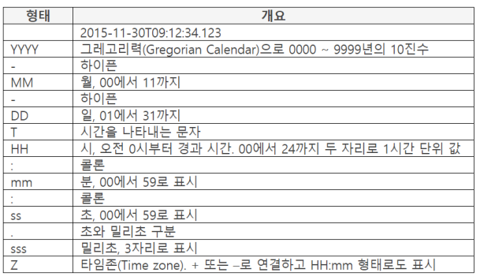
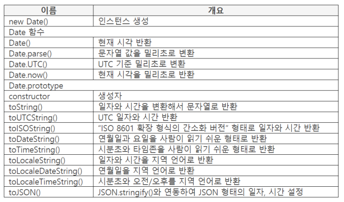
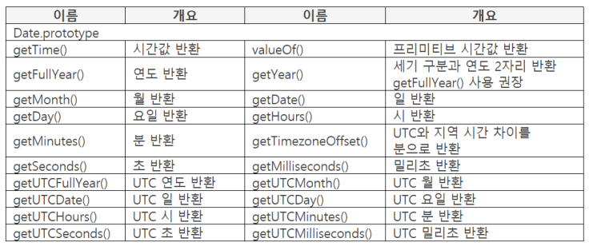
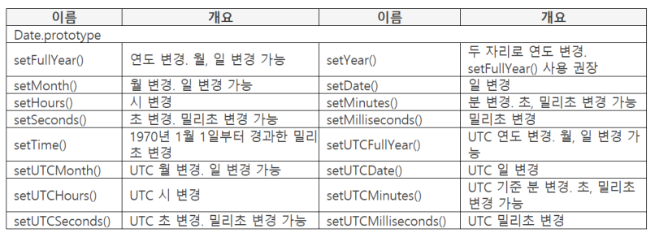

## Date 오브젝트

### Date 오브젝트 개요

- 년월일, 시분초, 밀리초 제공
    - 시간값(Time Value) 이라고 부름
- UTC(Universal Time Coordinated) 기준
    - 1970년 1월 1일 기준으로 밀리초를 제공. 남는 초는 무시
    - 1970.01.01 0시 기준으로 전후 100,000,000일 지원
- UTC와 GMT(Greenwich Mean Time)
    - JS는 UTC 기준

### 시간값 표시 기준

- 월은 0부터 시작
    - 0: 1월, 1: 2월, 11: 12월
- 일은 1에서 31일까지 정수로 표시
- 요일은 0부터 시작
    - 0: 일요일, 1: 월요일, 6: 토요일

        ```java
        var obj = new Date(1970, 1, 1, 1, 1, 1, 1);
        console.log(obj.toLocaleString());  // 1970. 2. 1. 오전 1:01:01
        ```

        - 년월일. 시분초. 밀리초

### 시간의 문자열 형태



## Date 오브젝트 프로퍼티

### 프로퍼티 리스트







### new Date()

- 파라미터 : 년, 월[, 일[, 시[, 분[, 초[, 밀리초]]]]]

    반환 : 생성한 Date 인스턴스

- Date 인스턴스 생성
    - 파라미터 값을 인스턴스의 프리미티브 값으로 설정

        ```java
        var obj = new Date(2019, 02);
        console.log(obj);  // Fri Mar 01 2019 00:00:00 GMT+0900 (한국 표준시)
        ```

        - 값을 작성하지 않으면 0으로 간주
- 파라미터를 작성하지 않으면 UTC 기준 현재 시간

    ```java
    console.log(new Date());  // Sun Sep 19 2021 20:13:40 GMT+0900 (한국 표준시)
    ```

- 파라미터를 문자열로 작성하면 밀리초로 변환

    ```java
    console.log(new Date("2019-02"));  // Fri Feb 01 2019 09:00:00 GMT+0900 (한국 표준시)
    ```

    - new Date(2019, 02)에서 02가 3월로 변환되지만 new Date("2019-02")는 2월로 변환된다.
- 시간 자동 넘김

    ```java
    console.log(new Date(2019, 11, 34));  // Fri Jan 03 2020 00:00:00 GMT+0900 (한국 표준시)
    ```

    - 월일시분초 범위를 넘치면 상위 시간값에 반영된다. 단, 문자열로 작성하면 에러가 난다.

### Date.now()

- object : Date 오브젝트

    파라미터 : 사용하지 않음

    반환 : 밀리초

- 현재 시간을 밀리초로 반환

    ```java
    console.log(Date.now());  // 1632050402831
    console.log(new Date());  // Sun Sep 19 2021 20:20:02 GMT+0900 (한국 표준시)
    ```

    - 값을 작성하지 않으면 0으로 간주
    - Date.now()와 new Date()가 같은 시간값이지만 값 표시가 다르다.

### Date.parse()

- object : Date 오브젝트

    파라미터 : 년월일, 시분초, 밀리초

    반환 : 밀리초

- 문자열 값을 밀리초로 변환
    - 1970.01.01부터 경과한 시간

        ```java
        console.log(Date.parse("2019-01-23T09:11:23.123"));  // 1548202283123
        ```

### Date 오브젝트 함수 분류

- 시간을 반환하는 함수
    - getMonth(), getDate() 등

        ```java
        var obj = new Date(2019, 02, 15);
        console.log(obj.getMonth());  // 2
        console.log(obj.getDate());  // 15
        ```

- 시간을 설정하는 함수
    - setMonth(), setDate() 등

        ```java
        var obj = new Date();
        console.log(obj.valueOf());  // 1632050707372
        console.log(obj.setMonth(01));  // 1613733907372
        console.log(obj.setDate(15));  // 1613388307372
        ```

- 함수 이름으로 기능을 알 수 있으므로 설명 생략
- 주의 사항
    - 클라이언트의 시간은 사용자가 변경 가능
    - 마감 시간처럼 시간이 중요할 때에는 서버 시간 사용