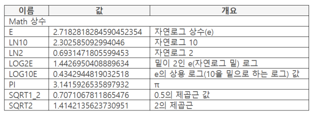
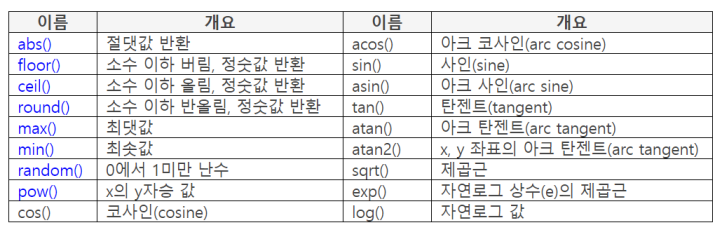

## Math 오브젝트 개요

- 수학 계산용 오브젝트
    - 상수, 절댓값, 사인, 탄젠트 등
- new 연산자로 인스턴스 생성 불가
    - Math, JSON, 글로벌 오브젝트
- 메소드가 아니라 함수
    - Math.abs(값) 형태

### Math 상수



### Math 함수



### abs()

- 파라미터 : 값

    반환 : 변환한 절댓값

- 음수를 양수로 변환한 절댓값 반환

    ```java
    console.log(Math.abs(-123));  // 123
    console.log(Math.abs(-Infinity));  //Infinity
    ```

### floor()

- 파라미터 : 값

    반환 : 변환한 값

- 소수 이하 버림, 정숫값 반환
- 소수 이하 값이 있으면서 음수이면 -1을 더해 반환

    ```java
    console.log(Math.floor(5.3));  // 5
    console.log(Math.floor(-1.7));  // -2
    console.log(Math.floor(-1.0));  // -1
    ```

### ceil()

- 파라미터 : 값

    반환 : 변환한 값

- 소수 이하 올림, 정숫값 반환

    ```java
    console.log(Math.ceil(5.1));  // 6
    console.log(Math.ceil(-1.7));  // -1
    console.log(Math.ceil(-0.3));  // 0
    ```

### round()

- 파라미터 : 값

    반환 : 변환한 값

- 소수 이하 반올림, 정숫값 반환
- 양수이면 반올림, 음수이면 반내림

    ```java
    console.log(Math.round(5.1));  // 5
    console.log(Math.round(5.5));  // 6
    console.log(Math.round(-1.6));  // -2
    console.log(Math.round(-1.3));  // -1
    ```

### max()

- 파라미터 : 콤마로 구분하여 값 작성

    반환 : 변환한 값

- 파라미터 값 중에서 가장 큰 값을 반환
- 파라미터 값을 전부 숫자로 변환하여 비교
    - NaN가 하나라도 있으면 NaN 반환

        ```java
        console.log(Math.max(5, 3, 9));  // 9
        console.log(Math.max(5, 3, "AB"));  // NaN
        ```

### min()

- 파라미터 : 콤마로 구분하여 값 작성

    반환 : 변환한 값

- 파라미터 값 중에서 가장 작은 값을 반환
- 파라미터 값을 전부 숫자로 변환하여 비교
    - NaN가 하나라도 있으면 NaN 반환

        ```java
        console.log(Math.min(5, 3, 9));  // 3
        console.log(Math.min(5, 3, "AB"));  // NaN
        ```

### pow()

- 파라미터 : x, y

    반환 : 변환한 값

- 파라미터 x 값의 y승 값을 반환
- y가 0일때 x 가 NaN라도 1을 반환
- y가 NaN이면 NaN 반환
- 이처럼 경우의 수가 많으므로 사용하기 전에 테스트 필요

    ```java
    console.log(Math.pow(10, 2));  // 100
    console.log(Math.pow(10, 0));  // 1
    console.log(Math.pow("A", 1));  // NaN
    console.log(Math.pow(1, "A"));  // NaN
    console.log(Math.pow(1));  // NaN
    ```

    - 두 번째 파라미터를 작성하지 않으면 NaN

### random()

- 파라미터 : 사용하지 않음

    반환 : 변환한 값

- 0에서 1미만 사이의 난수 반환

    ```java
    console.log(Math.random());  // 0.1038230700310474
    console.log(Math.random());  // 0.5704888447416316
    ```