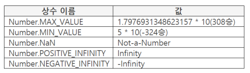

## Number 오브젝트

- 숫자 처리를 위한 오브젝트
- 즉, 숫자 처리를 위한 함수와 프로퍼티가 포함되어 있으며 함수를 호출하여 숫자처리를 하게된다.

## 프로퍼티 리스트


- 변환하는 함수는 to로 시작한다.
- 프리미티브 값은 인스턴스에 설정한 값을 의미한다. ex. new Number('123')

## Number()

- 파라미터 : 변환할 값opt

    반환 : 변환한 값

- 파라미터 값을 Number 타입으로 변환
- 파라미터 값이 String 타입이라도 값이 숫자이면 변환 가능

    ```java
    console.log(Number("123") + 500);  // 623
    console.log(Number("ABC"));  // NaN
    ```

- 숫자로 변환가능하면 변환

    ```java
    console.log(Number(0x14));  // 20
    console.log(Number(true));  // 1
    console.log(Number(null));  // 0
    console.log(Number(undefined));  // NaN
    ```

- 파라미터 값을 작성하지 않으면 0 반환

## Number 상수



- 상수는 값을 변경, 삭제할 수 없음
- 영문 대문자 사용이 관례
- Number.MAX_VALUE 형태로 값 사용
- ++ NaN 도 값이다. Number.NaN

## new 연산자

- constructor : 생성자

    파라미터 : 값opt

    반환 : 생성한 인스턴스

- 오브젝트로 인스턴스를 생성하여 반환. 원본을 복사하는 개념

    ```java
    var obj = new Number();
    console.log(typeof obj);  // object
    ```

- 코딩 관례로 첫 문자를 대문자로 작성
- 인스턴스 생성 목적 - 인스턴스마다 값을 갖기 위한 것

    ```java
    var oneObj = new Number("123");
    console.log(oneObj.valueOf());  // 123

    var twoObj = new Number("456");
    console.log(twoObj.valueOf());  // 456
    ```

    - 생성한 인스턴스에 별도의 이름을 줘서 해당 값을 저장한다.

## new Number()

- 파라미터 : 값opt

    반환 : 생성한 Number 인스턴스

- 빌트인 Number 오브젝트로 새로운 Number 인스턴스를 생성

    ```java
    var obj = new Number("123");
    console.log(obj.valueOf());  // 123
    ```

    - 인스턴스를 만들면 빌트인 Number 에 있는 프로퍼티들이 전부 복사되지 않고, prototype 프로퍼티만 복사된다. 복사된 값은 __proto__ 이름의 object 형태로 저장된다.

## 프리미티브 값, 프리미티브 타입, 프리미티브 값 구하기

### 프리미티브 값

- Primitive Value : 언어에 있어 가장 낮은 단계의 값
- var book = "책";

    "책"은 더 이상 분해, 전개 불가

- 프리미티브 타입
    - Number, String, Boolean: 인스턴스 생성 가능
    - Null, Undefined: 인스턴스 생성 불가
    - Object는 프리미티브 값을 제공하지 않음

    ```java
    var book = "책";
    var point = 123;
    ```

    - book, point 둘 다 값으로 단지 "책", 123만 가지고 있다. 이것이 프리미티브 값이다.

    ```java
    var obj = {book: "책"};
    ```

    - obj를 펼치면 다른 프로퍼티들이 있다. (__proto__) obj는 프리미티브가 아니다.

    ```java
    var instance = new Number(456);
    ```

    - 해당 값 456을 자바스크립트 엔진이 [[PrimitiveValue]] 라는 이름으로 저장한다.

### 인스턴스의 프리미티브 값

- var obj = new Number(123);

    인스턴스를 생성하면 파라미터 값을 인스턴스의 프리미티브 값으로 설정

- 프리미티브 값을 갖는 오브젝트
    - Boolean, Date, Number, String

    ```java
    var obj = new Numbeer(123);
    console.log(obj + 200);  // 323
    ```

    - 인스턴스와 숫자값을 연산하면 인스턴스의 [[PrimitiveVaue]] 값을 이용하여 계산한다.

### valueOf()

- data : Number 인스턴스, 숫자

    파라미터 : 사용하지 않음

    반환 : 프리미티브 값

- Number 인스턴스의 프리미티브 값 반환

    ```java
    var obj = new Number("123");
    console.log(obj.valueOf());  // 123
    ```

## String 타입으로 변환, 지역화문자

### toString()

- data : 변환 대상

    파라미터 : 진수(2~36)opt, 디폴트 : 10진수

    반환 : 변환한 값

- data를 String 타입으로 변환

    ```java
    var value = 20;
    console.log(20 === value.toString());  // false
    console.log(value.toString(16));  // 14
    ```

- 변환 시 주의사항 (유동 소수점 사용)

    ```java
    console.log(20..toString());  // 20
    ```

    - 20이 아니라 20. 을 변환 대상으로 인식하므로 점이 없는 valuetoString() 형태가 되기 때문에 코드처럼 20..을 작성한다.

### toLocaleString()

- data : 변환대상

    파라미터 : 사용하지 않음

    반환 : 변환한 값

- 숫자를 브라우저가 지원하는 지역화 문자로 변환 (지역화 : 한국, 중국, 프랑스 등 지역에서 사용하는 문자)

    지역화 지원 및 형태를 브라우저 개발사에 일임. → 브라우저마다 차이가 날 수 있다.

    지역화를 지원하지 않으면 toString() 으로 변환

- 스펙 상태
    - ES5 : 파라미터 사용 불가
    - ES6 : 파라미터에 언어 타입 사용 가능

        ```java
        console.log(value.toLocaleString());  // 1,234.56
        console.log(value.toLocaleString('de-DE'));  // 1.234,56
        console.log(value.toLocaleString('zh-Hans-CN-u-nu-hanidec'));  // 一,二三四.五六
        ```

        - 파라미터에 독일이나 중국 등 나라를 작성하면 해당 나라의 표시방식으로 표시한 값을 반환한다.

## 지수 표기, 고정 소숫점 표기

### toExponential()

- data : 변환 대상

    파라미터 : 소수 이하 자릿수(0~20)

    반환 : 변환한 값

- 숫자를 지수표기로 변환하여 문자열로 반환
- 파라미터에 소수 이하 자릿수 작성. 0~10까지
- 표시방법
    - 변환 대상의 첫 자리만 소수점(.) 앞에 표시
    - 나머지는 소수 아래에 표시
    - 지수(e+)다음에 정수에서 소수로 변환된 자릿수 표시

    ```java
    var value = 1234;
    console.log(value.toExponential());  // 1.234e+3
    ```

    ```java
    var value = 123456;
    console.log(value.toExponential(3));  // 1.235e+5
    ```

    - 파라미터에 3 작성했으므로 소수이하 자릿수 3까지 표시
    - 1.2345에서 반올림을 한 뒤 표시하기 때문에 1.235e+5 가 된다.

### toFixed()

- data : 변환 대상

    파라미터 : 변환할 소수 이하 자릿수

    반환 : 변환한 값

- 고정 소숫점 표기로 변환하여 문자열로 변환
- 파라미터에 소수 이하 자릿수 작성. 0~20까지
- 표시 방법
    - 파라미터 값보다 소수 자릿수가 길면 작성한 자리수에 1을 더 한 위치에서 반올림

        ```java
        var value = 1234.567;
        console.log(value.toFixed(2));  // 1234.57
        console.log(value.toFixed());  // 1235
        ```

        - 파라미터로 2를 넘겼을 때 소수자릿수인 3이 파라미터 2보다 크기 때문에 2 + 1 한 3의 위치에서 반올림한 값 1234.57 반환
    - 변환 대상 자릿수보다 파라미터 값이 크면 나머지를 0으로 채워 반환

        ```java
        var value = 1234.567;
        console.log(value.toFixed(5));  //  1234.56700
        ```