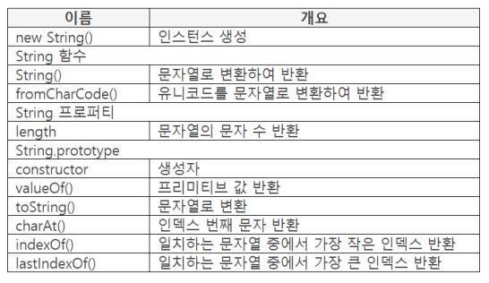
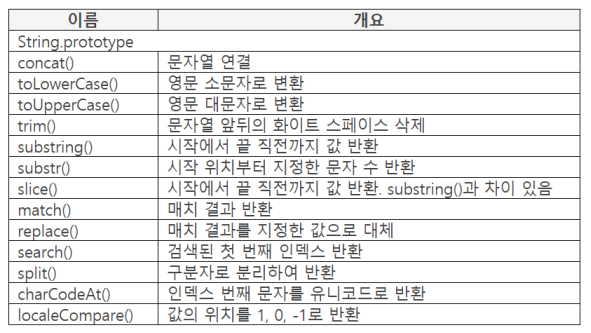

## 문자열 연결 방법

- 한줄에서 연결

    ```java
    var book = "12" + "AB" + "가나";
    ```

- 줄을 분리하여 연결
    - +로 문자열 연결

        ```java
        var concat = 123 + "abc" + 
        								"가나다라";
        console.log(concat);  // 123abc가나다라
        ```

    - 역슬래시(\)로 문자열 연결

        ```java
        var concat = "abc \
        								가나다라";
        console.log(concat);  // 123abc가나다라
        ```

        - 일반적으로 사용하지 않는다.

## 프로퍼티 리스트





## 문자열로 변환, 프리미티브 값 구하기

### String()

- 파라미터 : 변환 대상opt

    반환 : 변환한 값

- 파라미터 값을 String 타입으로 변환하여 반환

    값을 작성하지 않으면 빈 문자열 반환

    ```java
    var value = String(123);
    console.log(value);  // 123
    console.log(typeof value)  // string
    console.log(typeof ("" + 123));  // string
    ```

    - ("" + 123)도 숫자가 String 타입이 되지만 String(123) 형태가 가독성이 높다.

### new String()

- 파라미터 : 값opt

    반환 : 생성한 String 인스턴스

- String 인스턴스를 생성하여 반환
- 파라미터 값을 String 타입으로 변환. 파라미터 값이 프리미티브 값이 된다.

    ```java
    var obj = new String(123);
    console.log(typeof obj);  // object
    ```

### valueOf()

- data : String 인스턴스, 문자

    파라미터 : 사용하지 않음

    반환 : 프리미티브 값

- String 인스턴스의 프리미티브 값 반환

    ```java
    var obj = new String(123);
    console.log(obj.valueOf());  // 123
    ```

## length 프로퍼티, length 값 반환 논리

- 문자 수 반환

    ```java
    var value = "ABC";
    console.log(value.length);  // 3
    ```

- length 프로퍼티 활용

    ```java
    var value = "ABC";
    for (var k = 0; k < value.length; k++) {
    	console.log(value[k]);
    }

    // A
    // B
    // C
    ```

- length 값이 반환되는 논리 (value변수에는 length 프로퍼티가 없는데 어떻게 사용 가능?에 대한 논리)
    1. value.length를 만나면 먼저 해당 값의 타입을 구한다.
    2. 타입에 따라 자바스크립트는 내부적으로 new 연산자를 사용해 인스턴스를 만든다. String이면 new String("ABC"), Number면 new Number(123) 등 (해당 프로퍼티 호출이 끝나면 만든 내부 인스턴스를 지운다. 따라서 length를 만나면 임시로 인스턴스를 생성하고 length가 끝나면 지운다.  )
    3. 해당 내부 인스턴스에 length 프로퍼티가 있으므로 사용 가능하다.

    - length 뿐만 아니라 [[PrimitiveValue]] 또한 자바스크립트가 만드는데 [[ ]] 는 외부에서 사용하지 않고 내부에서 사용한다는 의미이고 length는 외부에서 사용할 수 있다는 의미

        따라서 PrimitiveValue를 사용하려면 valueOf를 사용해야 접근 가능하다.

    - "ABC"로 for()문을 반복할 때 마다 문자를 하나씩 읽을 수 있는 것은 내부에서 문자를 하나씩 분리해서 인스턴스에 0: "A, 1: "B", 2: "C" 처럼 프로퍼티 형태로 저장하기 때문이다.

## 화이트 스페이스 삭제

### trim()

- data : 삭제 대상

    파라미터 : 사용하지 않음

    반환 : 삭제한 결과

- 문자열 앞뒤의 화이트 스페이스 삭제

    ```java
    var value = "  abcd  ";
    console.log(value.length);  // 8
    console.log(value.trim().length);  // 4
    ```

    - value.trim().length ⇒ abcd.length 한것과 같다.
- 메소드 체인

    value.trim().length 처럼 점과 점으로 연결된 형태를 메소드 체인이라고 한다.

## 함수 호출 구조, __proto__구조

### toString()

- data : 문자열, String 인스턴스

    파라미터 : 사용하지 않음

    반환 : 변환한 값

- data 위치의 값을 String 타입으로 변환
- "123".toString(); → String 타입을 String 타입으로 변환. 의미가 없다?

### toString() 함수가 필요한 이유

```java
var instance = new String("123");
var oneProto = instance.__proto__.toString;
var twoString = instance.__proto__.__proto__.toString;
```

- instance 를 펼쳐보면 __proto__ 가 있고 그 안에 toString이 있다.
- 뿐만 아니라 __proto__안에는 또 하나의 __proto__가 있고 그 안에는 또 toString이 있다.
- 자바스크립트는 첫번째 __proto__안에 toString) 없으면 다시 __proto__아래에 있는 __proto__에 가서 toString을 찾는다. 그 아래에도 없으면 오류가 난다.
- 따라서 자바스크릡트는 __proto__구조를 갖는다. 그리고 계층적으로 내려가면서 호출한 함수를 찾는다.
- 여기서 첫번재 __proto__와 그 아래 __proto__는 다르다. 첫번째__proto__는 String 오브젝트로 단일값만 작성하는데 두번째 __proto__는 빌트인 오브젝트로 키 밸류 형태로 작성한다. 그래서 String을 키 벨류 형태로 작성하는 부분에 넣으면 이상하기 때문에 앞에서 두번째 __proto__가 실행되지 않게 하기 위해 toString이 존재한다.
- 프로퍼티를 toString으로 변환하게 하기 위한 것이고 위에 것은 문자열을 toString으로 변환하게 하기 위한 것
- 그래서 대부분의 빌트인 오브젝트에 toString()과 valueOf()가 있다.

### JS 함수 호출 구조

- 우선 데이터 타입으로 오브젝트를 결정하고 오브젝트의 함수를 호출한다.

    ```java
    var value = 123;
    value.toString();

    "123".toString();
    ```

    - value.toString()은 Number 오브젝트의 toString()을 호출한다.
    - "123".toString()은 String 오브젝트의 toString()을 호출한다.
- toString(123)

    ```java
    var result = toString(123);
    console.log(result);  // [object Undefined]
    ```

    - 함수 앞에는 아무것도 작성하지 않고 파라미터에 값을 작성하면 Object 오브젝트의 toString()이 호출된다.
    - 123을 오브젝트로 간주하여 Object 형태를 문자열로 변환한다.

## 인덱스로 문자열 처리

### charAt()

- data : 반환 대상

    파라미터 : 반환 기준 인덱스(Index)

    반환 : 인덱스 번째 문자

- 인덱스의 문자를 반환

    ```java
    var value = "sports";
    console.log(value.charAt(1));  // p
    console.log(value[1]);  // p
    ```

    - value.charAt(1)을 ES5에서 [1] 형태로 사용할 수 있다.
- 문자열 길이보다 인덱스가 크면 빈 문자열 반환

    ```java
    var value = "sports";
    console.log(value.chartAt(12));  // ""
    ```

- 일반적으로 존재하지 않으면 undefined를 반환

    ```java
    var value = "sports";
    console.log(value[12]);  // undefined
    ```

    - [ ]를 사용시에는 해당 인덱스들이 프로퍼티로 저장되어 있고 그 값을 가져오는 형식이기 때문에 적절하지 않은 인덱스를 사용시 해당하는 프로퍼티가 없으므로 undefined를 반환한다. chartAt과는 차이가 있다.
    - ""는 결국 값이기 때문에 개념적으로 undefined 반환이 적절하다.

### indexOf()

- data : 검색 대상
- 파라미터 : 검색할 문자열, 검색시작위치(디폴트: 0)
- 반환 : 인덱스
- data위치의 문자열에서 파라미터의 문자와 같은 첫번째 인덱스를 반환
- 검색 기준
    - 왼쪽에서 오른쪽으로 검색

        ```java
        var value = "123123";
        console.log(value.indexOf(2));  // 1
        ```

    - 두 번째 파라미터를 작성하면 작성한 인덱스부터 검색

        ```java
        var value = "123123";
        console.log(value.indexOf(2, 3));  // 4
        ```

    - 같은 문자가 없으면 -1 반환

        ```java
        var value = "123123";
        console.log(value.indexOf(15));  // -1
        ```

        ```java
        var value = "123123";
        console.log(value.indexOf(2, -1));  // 1
        console.log(value.indexOf(2, 9));  // -1
        console.log(value.indexOf(2, "A"));  // 1
        ```

        - 두번째 파라미터 값이 0보다 작거나 NaN이면 처음부터 검색

### lastIndexOf()

- data : 검색 대상

    파라미터 : 검색할 문자열, 검색시작위치(디폴트 : 0)

    반환 : 인덱스

- data 위치의 문자열에서 파라미터의 문자와 같은 인덱스를 반환. 단, 뒤에서 앞으로 검색

    ```java
    var value = "123123";
    console.log(value.lastIndexOf(2));  // 4
    ```

- 검색기준
    - 두번째 파라미터를 작성하면 작성한 인덱스부터 검색

        ```java
        var value = "123123";
        console.log(value.lastIndexOf(1, 4));  // 3
        console.log(value.lastIndexOf(2, -1));  // -1
        ```

        - 두번째 파라미터가 0보다 작으면 -1 반환
    - 같은 문자가 없으면 -1 반환

## 문자열 연결, 대소문자 변환

### concat()

- data : 연결 시작 값, String 인스턴스

    파라미터 : 연결 대상 opt, 다수 작성 가능

    반환 : 연결한 결과

- data 위치의 값에 파라미터 값을 작성 순서로 연결하여 문자열 반환

    ```java
    var result = "sports".concat("축구", 11);
    console.log(result);  // sports축구11
    ```

- String인스턴스를 작성하면 프리미티브 값을 연결

    ```java
    var obj = new String(123);
    console.log(obj.concat("ABC"));  // 123ABC
    ```

### toLowerCase()

- data : 변환 대상

    파라미터 : 사용하지 않음

    반환 : 변환 결과

- 영문 대문자를 소문자로 변환

    ```java
    console.log("ABCDE".toLowerCase());  // abcde
    ```

### toUpperCase()

- data : 변환 대상

    파라미터 : 사용하지 않음

    반환 : 변환 결과

- 영문 소문자를 대문자로 변환

    ```java
    console.log("abcde".toUpperCase());  // ABCDE
    ```

## 문자열 추출

### substring()

- data : 반환 대상

    파라미터 : 시작 인덱스, 끝 인덱스

    반환 : 결과

- 파라미터의 시작 인덱스부터 끝 인덱스 직전까지 반환

    ```java
    var value = "01234567";
    console.log(value.substring(2, 5));  // 234
    ```

- 두번째 파라미터를 작성하지 않으면 반환 대상의 끝까지 반환

    ```java
    var value = "01234567";
    console.log(value.substring(5));  // 567
    console.log(value.substring());  // 01234567
    ```

- 다양한 추출 조건 작성

    ```java
    var value = "01234567";
    console.log(value.substring(5, 20));  // 567
    ```

    - 두번째 파라미터 값이 전체 length보다 크면 전체 문자열 length 사용
    - 따라서 시작 인덱스부터 끝까지 반환

    ```java
    var value = "01234567";
    console.log(value.substring(-7, 2));  // 01
    console.log(value.substring(5, 1));  // 1234
    console.log(value.substring(5, "A"));  // 01234
    ```

    - 파라미터 값이 음수이면 0으로 간주 0~2번 인덱스 직전까지 반환
    - 첫번째 파라미터 값이 두 번째보다 크면 파라미터 값을 바꿔서 처리하므로 value.substring(1, 5) 형태가 됨
    - NaN는 0으로 간주. 첫번째 파라미터 값이 두번째보다 크므로 value.substring(0, 5) 형태가 됨

### substr()

- data : 반환 대상

    파라미터 : 시작 인덱스, 반환할 문자 수

    반환 : 결과

- 파라미터의 시작 인덱스부터 지정한 문자 수를 반환

    ```java
    var value = "01234567";
    console.log(value.substr(0, 3));  // 012
    ```

- 첫번째 파라미터 값이 음수이면 length에서 파라미터 값을 더해 시작 인덱스로 사용

    ```java
    var value = "01234567";
    console.log(value.substr(-3, 3));  // 567
    ```

- 두번째 파라미터를 작성하지 않으면 양수 무한대로 간주

    ```java
    var value = "01234567";
    console.log(value.substr(4));  // 4567
    console.log(value.substr());  // 01234567
    ```

### slice()

- data : 반환 대상

    파라미터 : 시작 인덱스, 끝 인덱스

    반환 : 결과

- 파라미터의 시작 인덱스부터 끝 인덱스 직전까지 반환

    ```java
    var value = "01234567";
    console.log(value.slice(1, 4));  // 123
    console.log(value.slice(false, 4));  // 0123
    ```

    - false, undefined, null, 빈 문자열은 0으로 간주
- 첫번째 파라미터
    - 값을 작성하지 않거나 NaN이면 0으로 간주

    ```java
    var value = "01234567";
    console.log(value.slice("A"));  // 01234567
    console.log(value.slice());  // 01234567
    ```

- 두번째 파라미터
    - 작성하지 않으면 length 사용. 값이 음수이면 length에 더해 사용

    ```java
    var value = "01234567";
    console.log(value.slice(5));  // 567
    console.log(value.slice(5, 3));  // ""
    ```

    ```java
    var value = "01234567";
    console.log(value.slice(4, -2));  // 45
    console.log(value.slice(-5, -2));  // 345
    console.log(value.slice(-2, -5));  // ""
    ```

    - 파라미터 값이 음수이면 length를 더해 사용. 더한값이 0보다 작으면 0을 사용

## 정규 표현식을 사용할 수 있는 함수

### match()

- data : 매치 대상

    파라미터 : 정규표현식, 문자열

    반환 : [매치 결과]

- 매치 결과를 배열로 반환
    - 매치 대상에 정규 표현식의 패턴을 적용하여 매치하고 매치 결과를 반환
    - 문자열 작성 가능. 엔진이 정규 표현식으로 변환하여 매치

        ```java
        var value = "Sports";
        console.log(value.match(/s/));  // [s]
        console.log(value.match("spo"));  // null
        ```

        - 정규표현식은 / / 사이에 작성한다.
        - 소문자 대문자를 구분하기 때문에 spo는 null을 반환한다.
        - match함수를 사용하면 정규표현식 오브젝트(빌트인 오브젝트)의 exec와 같은 함수를 호출한 뒤 정규표현식 형태로 변환해서 매치한다. 그렇기 때문에 null개념이 나오는 것이다.
- 정규 표현식
    - 문자열을 패턴으로 매치
    - 패턴(pattern) 형태 : ^, $, *, + 등

### replace()

- data : 치환 대상

    파라미터 : 정규 표현식 or 문자열, 대체할 값 or 함수

    반환 : 치환 결과

- 매치 결과를 파라미터에 작성한 값으로 대체하여 반환
- 두 번째 파라미터에 함수를 작성하면 먼저 함수를 실행하고 함수에서 반환한 값으로 대체

    ```java
    var value = "abcabc";
    console.log(value.replace("a", "바꿈"));  // 바꿈bcabc
    console.log(value.replace(/a/, "바꿈"));  // 바꿈bcabc

    function change() {
    	return "함수";
    }

    console.log(value.replace(/a/, change()));  // 함수bcabc
    ```

    - /a/는 처음 하나만 바꿈
    - 함수를 실행하고 반환된 값으로 바꿈

### search()

- data : 검색 대상

    파라미터 : 정규 표현식, 문자열

    반환 : 매치된 인덱스

- 검색된 첫 번째 인덱스 반환
    - 매치되지 않으면 -1 반환

        ```java
        var value = "cbacba";
        console.log(value.search(/a/));  // 2
        console.log(value.search("K"));  // -1
        ```

### split()

- data : 분리 대상

    파라미터 : 분리자(정규표현식, 문자열), 반환 수

    반환 : 결과

- 분리 대상을 분리자로 분리하여 배열로 반환

    ```java
    console.log("12_34_56".split("_"));  // [12, 34, 56]
    ```

- 분리자를 작성하지 않은 경우

    ```java
    var value = "123";
    console.log(value.split(""));  // [1, 2, 3]
    console.log(value.split());  // [123]
    ```

    - 분리자에 빈 문자열을 작성하면 문자를 하나씩 분리하여 반환
    - 분리자를 작성하지 않으면 분리 대상 전체를 하나의 배열로 반환
- 두번째 파라미터에 반환 수를 작성

    ```java
    var value = "12_34_56_78";
    console.log(value.split("_", 3));  // [12, 34, 56]

    value = "123";
    console.log(value.split("A"));  // [123]
    ```

    - 두 번째 파라미터에 숫자를 작성하면 앞에서부터 수만큼만 반환
    - 분리자가 분리 대상에 없으면 분리 대상 전체를 하나의 배열로 반환

## Unicode 관련 함수

### charCodeAt()

- data : 반환 대상

    파라미터 : 반환 기준 인덱스

    반환 : 인덱스 번째 문자

- 인덱스 번째의 문자를 유니코드의 코드포인트 값을 반환
- 인덱스가 문자열 길이보다 크면 NaN 반환

    ```java
    var value = "1Aa가";
    for (var k =0; k < value.length; k++) {
    	console.log(value.charCodeAt(k));
    }
    console.log(value.charCodeAt(12));

    // 49
    // 65
    // 97
    // 44032
    // NaN
    ```

    - charCodeAt(12)에서 12번째가 없으며 NaN 반환

### fromCharCode()

- data : String 오브젝트

    파라미터 : 유니코드, 다수 작성 가능

    반환 : 변환한 문자

- 파라미터의 유니코드를 문자열로 변환하고 연결하여 반환.
    - 작성하지 않으면 빈 문자열 반환
- 작성 방법
    - data 위치에 String 오브젝트 작성. 변환 대상 값을 작성하지 않음
    - String.fromCharCode() 형태

        ```java
        console.log(String.fromCharCode(49, 65, 97, 44032));  // 1Aa가
        ```

        - String 빌트인 오브젝트의 prototype이 아닌 같은 레벨에 있는 함수이므로 다른 value.charCodeAt(k) 함수처럼 앞에 대상을 쓰고 함수를 작성함으로써 String 인스턴스를 만들고 그 함수를 쓰는게 아닌 직접 원본인 String 빌트인 오브젝트의 함수에 접근하여 사용하여야 한다. 따라서 인스턴스를 만드는 것이 아니므로 String.fromcharCode() 로 사용한다.
        - 함수앞에 값을 넣어서 사용할 수 없는 이유는 일단 하나의 값이 아닌 여러값을 넣어야 하는데 그러면 배열을 사용하여야 한다. 하지만 배열을 함수앞에 작성하면 자바스크립트는 함수앞에 작성한 타입에 따라 오브젝트를 부른다는 규칙에 따라 String이 아닌 배열 오브젝트를 부르게 되므로 이 방법은 적절치 않다. 따라서 이 함수를 프로토타입에 넣지 못하고 원본인 String 빌트인 오브젝트에 넣은 것이다.

### localeCompare()

- data : 비교 대상

    파라미터 : 비교할 값

    반환 : 1(앞), 0(같음), -1(뒤)

- 값을 비교하여 위치를 나타내는 값으로 반환
- 위치 값 : 1(앞), 0(같음), -1(뒤)
- Unicode 사전 순으로 비교

    ```java
    var value = "나";
    console.log(value.localeCompare("가"));  // 1
    console.log(value.localeCompare("나"));  // 0
    console.log(value.localeCompare("다"));  // -1
    ```