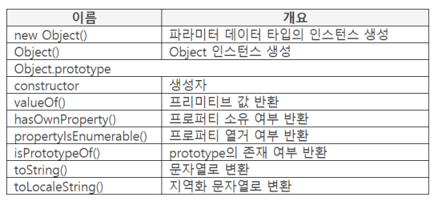
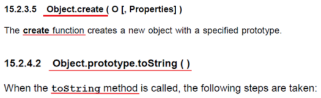
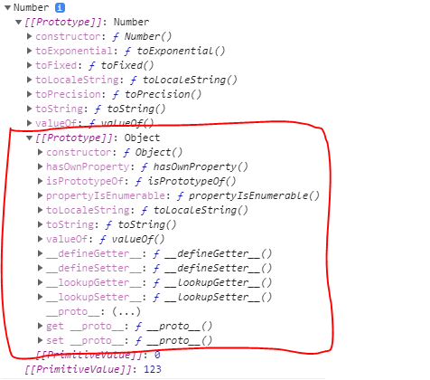

## 자바스크립트 오브젝트

### 오브젝트 구분

- 빌트인 오브젝트 Built-in Object
- 네이티브 오브젝트 Native Object
- 호스트 오브젝트 Host Object

### 빌트인 오브젝트

- 사전에 만들어놓은 오브젝트
- 빌트인 Number 오브젝트, 빌트인 String 오브젝트

### 네이티브 오브젝트

- JS 스펙에서 정의한 오브젝트
- 빌트인 오브젝트 포함, JS 코드를 실행할 때 만드는 오브젝트

    ex) Argument 오브젝트(함수가 호출되면 함수안에서 만들고 함수를 빠져나오면 자바스크립트 엔진이 자동으로 지움. 빌트인하고 비슷하지만 사용성에서 차이가 있다.)

- 빌트인 오브젝트가 네이티브 오브젝트에 속하므로 네이티브와 호스트 오브젝트로 구분할 수 있다. (ES5 기준. ES6에서는 좀 더 세분화 되어있음)

### 호스트 오브젝트

- 빌트인, 네이티브 오브젝트를 제외한 오브젝트

    ex) window, DOM(Document Object Model) 오브젝트

    ```java
    var node = document.querySelector("div");
    console.log(node.nodeName);  // DIV
    ```

    - querySelector() 는 자바스크립트 스펙에 작성된 자바스크립트가 제공하는 함수가 아니라 DOM에서 제공하는 함수이다. 하지만 어떠한 처리를 하지 않고 사용함으로써 마치 JS함수처럼 DOM 함수를 사용하고 있다. 이러한 오브젝트를 호스트 오브젝트라고 한다.
- JS는 호스트 환경에서 브라우저의 모든 요소 기술을 연결하고 융합하며 이를 제어

## 오브젝트와 인스턴스

- 강좌에서는 오브젝트는 new 연산자를 사용하지 않고 빌트인 오브젝트로 만든 오브젝트를 지칭

    ```java
    var abc = new Object();
    var obj = {};
    ```

    - new 연산자를 사용한 abc는 인스턴스
    - 사용하지 않은 obj는 오브젝트
- 오브젝트를 번역하면 객체이지만 뉘앙스 차이 있다.

## 빌트인 Object 프로퍼티(ES3)

### 프로퍼티 리스트(ES3)



- new String() 이나 new Number()는 각 타입에 맞는 인스턴스를 만들지만 new Object() 는 파라미터 타입에 따라 인스턴스를 만들기도 한다.
- 값을 반환하는 String(), Number()와는 다르게 Object()는 Object 인스턴스를 생성한다.

## Object 인스턴스 생성

### new Object()

- 파라미터 : 값opt

    반환 : 생성한 인스턴스

- 인스턴스를 생성하여 반환
- 파라미터의 데이터 타입에 따라 생성할 인스턴스 결정

    ```java
    var newNum = new Number(123);
    console.log(typeof newNum);  // object
    ```

    ```java
    var newObj = new Object(123);
    console.log(typeof newObj);  // object
    console.log(newObj + 100);  // 223
    ```

    - new Object는 key value로 이루어진 프로퍼티이기때문에 newObj + 100을 하면 이상하지만 223으로 값이 제대로 출력되었다. 그 이유는 new Object()는 파라미터 값에 따라서 인스턴스 타입이 결정되므로  newObj는 Number 인스턴스로 생성되었기 때문이다.
    - 따라서 new Object()는 파라미터 값 타입이 Number 타입이면 Number 인스턴스를 생성하고 String 타입이면 String 인스턴스를 생성
- 파라미터 값이 undefined, null 이면 빈 Object 인스턴스 반환

    ```java
    var newObj = new Object();
    console.log(newObj);  // {}
    ```

    - 파라미터를 작성하지 않으면 undefined를 작성한 것과 같으며 값을 갖지 않은 Object 인스턴스 생성

## Object()

- 파라미터 : 값opt

    반환 : 생성한 인스턴스

- Object 인스턴스 생성
    - 파라미터는 {nama: value} 형태

        ```java
        var obj = Objet({nama: "JS책"});
        console.log(obj);  // {nama: JS책}

        var emptyObj = Object();
        console.log(emptyObj);  // {}
        ```

### Object 생성 방법

- var abc = {};
    - var abc = Object() 와 같음. 즉, var abc = {}를 실행하면 Object 인스턴스가 생성됨

        ```java
        var obj = Object({name: "value"});
        console.log(obj);  // {name: value}
        console.log(obj instanceof Object);  // true
        ```

        ```java
        var obj = {name: "value"};
        console.log(obj);  // {name: value}
        console.log(obj instanceof Object);  // true
        ```

        - Object()와 Object 리터럴{}모두 Object 인스턴스를 생성한다.
        - 그래서 Object()를 사용하지 않고 간단하게 {}를 사용한다.
- {} 표기를 오브젝트 리터럴Literal이라고 부름

## 프리미티브 값 구하기

### valueOf()

- data : Object 인스턴스, 숫자

    파라미터 : 사용하지 않음

    반환 : 프리미티브 값

- data 위치에 작성한 Object 인스턴스의 프리미티브 값 반환

    ```java
    var obj = {key: "value"};
    console.log(obj.valueOf());  // {key: value}
    ```

    - {key: "value"} 이 프리미티브 값으로 설정되기 때문에 값 반환

## 빌트인 오브젝트 구조

- 오브젝트 이름(Object, String, Number...)
- 오브젝트.prototype
    - 인스턴스 생성 가능 여부 기준 (ex. String, Number 프로토타입이 있지만 Math는 프로토타입이 없어 인스턴스를 만들 수 없다.)
    - 프로퍼티를 연결하는 오브젝트
- 오브젝트.prototype.constructor
    - 오브젝트의 생성자
    - new Number() 하게되면 내부에서 오브젝트.prototype.constructor를 호출해 인스턴스를 생성한다.
    - prototype이 있으면 디폴트로 constructor가 따라 붙는다.
    - constructor 를 펼쳐보면 상위의 빌트인 오브젝트에 있는 메소드들이 그대로 들어있는데, 이것이 존재하기 때문에 생성자를 불렀을 때 인스턴스를 생성할 수 있는 것이다.
- 오브젝트.prototype.method
    - 메소드 이름과 함수 작성

## 함수와 메소드

### 함수와 메소드 연결

- 함수
    - 오브젝트에 연결
    - Object.create()
- 메소드
    - 오브젝트의 prototype에 연결
    - Object.prototype.toString()



### 함수, 메소드 호출

- 함수 호출 방법
    - Object.create();

        ```java
        console.log(Object.create);  // function create() {[native code]}
        console.log(Object.prototype.create);  // undefined
        ```

- 메소드 호출 방법
    - Object.prototype.toString();

        또는 인스턴스를 생성하여 호출

        ```java
        console.log(Object.prototype.toString);  // function toString() {[native code]}

        var obj = {};
        console.log(obj.toString);  // function toString() {[native code]}
        ```

- 함수와 메소드를 구분해야 하는 이유
    - JS 코드 작성 방법이 다르기 때문
    - 함수는 파라미터에 값을 작성하고 메소드는 메소드 앞에 값을 작성

        ```java
        console.log(String.fromCharCode(49, 65));  // 1A
        ```

## 프로퍼티 처리 메소드

### hasOwnProperty()

- object : 기준 인스턴스

    파라미터 : 프로퍼티 이름

    반환 : true, false

- 인스턴스에 파라미터이름이 존재하면 ture, 존재하지 않으면 false 반환

    ```java
    var obj = {value: 123};
    var own = obj.hasOwnProperty("value");
    console.log(own);  // true
    ```

    ```java
    var obj = {value: undefined};
    var own = obj.hasOwnProperty("value");
    console.log(own);  // true
    ```

    - undefined가 값이지만 값은 체크하지 않고 존재 여부만 체크하므로 true 반환
- 자신이 만든 것이 아니라 상속받은 프로퍼티이면 false 반환

    ```java
    var obj = {};
    var own = obj.hasOwnProperty("hasOwnProperty");
    console.log(own);  // false
    ```

    - hasOwnProperty()는 자신이 만든것이 빌트인 Object 오브젝트에 있는 것이므로 false

### propertyIsEnumerable()

- object : 인스턴스, 오브젝트

    파라미터 : 프로퍼티 이름

    반환 : true, false

- 오브젝트에서 프로퍼티를 열거할 수 있으면 true, 열거할 수 없으면 false 반환

    ```java
    var obj = {sports: "축구"};
    console.log(obj.propertyIsEnumberable("sports"));  // true
    ```

    ```java
    var obj = {sports: "축구"};
    Object.defineProperty(obj, "sports", {
    	enumerable: false
    });  // 열거할 수 없는 상태로 설정한다.
    console.log(obj.propertyIsEnumerable("sports"));  // false

    for (var name in obj) {
    	console.log(name);
    }
    ```

## Object 와 prototype

### 빌트인 Object 특징

- 인스턴스를 만들 수 있는 모든 빌트인 오브젝트의 __proto__에 Object.prototype의 6개 메소드가 설정됨
- 따라서 빌트인 오브젝트로 만든 인스턴스에도 설정됨



### isPrototypeOf()

- object : 검색할 오브젝트.prototype

    파라미터 : 검색 대상 오브젝트

    반환 : true, false

- 파라미터에 작성한 오브젝트에 object 위치에 작성한 prototype이 존재하면 true, 존재하지 않으면 false 반환

    ```java
    var numObj = new Number(123);
    console.log(Object.prototype.isPrototypeOf(numObj));  // true
    ```

### toString()

- object : Object 인스턴스

    파라미터 : 사용 불가

    반환 : 변환한 값

- 인스턴스 타입을 문자열로 표시

    ```java
    var point = {book: "책"};
    console.log(point.toString());  // [object Object]

    var obj = new Number(123);
    console.log(Object.prototype.toString.call(obj));  // [object Number]
    ```

    - [object Object] 의 앞의 소문자 object는 인스턴스를 나타내고 뒤의 대문자 Object는 빌트인 Object를 나타낸다.
    - 프로토타입에 연결되어있는 메소드를 인스턴스를 만들지 않고 직접 호출할 때에는 call()을 사용한다.
    - [object Number] 의 Number는 obj라는 인스턴스를 만든 타입이다. 즉 오브젝트 이름이다.

### toLocaleString()

- data : 변환 대상

    파라미터 : 사용하지 않음

    반환 : 변환한 값

- 지역화 문자 변환 메소드 대체 호출
    - Array, Number, Date 오브젝트의 toLocaleString() 메소드가 먼저 호출된다.

        ```java
        console.log(1234.56.toLocaleString());  // 1,234.56
        console.log("4567.89".toLocaleString());  // 4567.89
        ```

        - Number 빌트인 오브젝트에는 toLocaleString() 이 있으므로 Number.prototype.toLocaleString() 메소드가 호출된다.
        - String 빌트인 오브젝트에는 toLocaleString() 이 없으므로 Object.prototype.toLocaleString() 메소드가 호출된다.
        - Object의 toLocaleString()이 없으면 에러가 발생하므로 에러 발생을 방지하기 위한 것이다. 따라서 String을 toLocaleString() 할 때에는 출력하는 용도에 지나지 않는다.